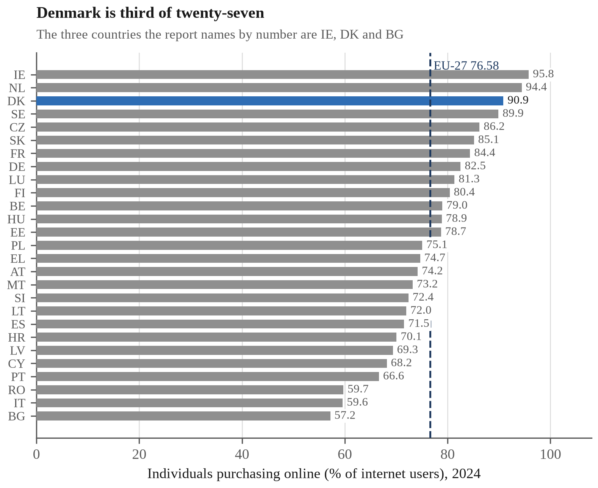
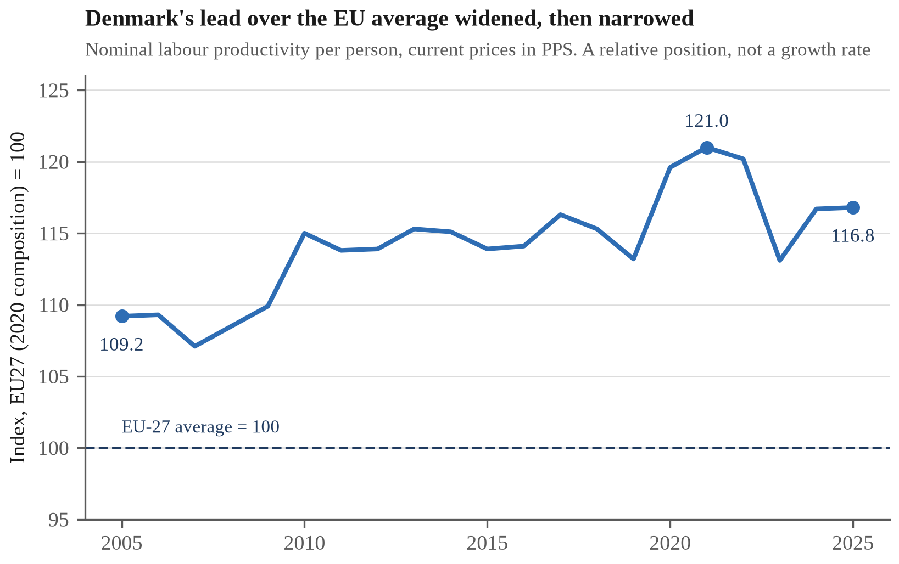

# Digital Policy and Innovation Report - Denmark

ECON1596/ECON1597 Assessment 2 | s4040040 | Class group: [TO BE CONFIRMED]  
Submitted 17 September 2026  
Accompanying data file: ECON1596_A2_Denmark_DataWorkbook_s4040040.xlsx

> **Thesis.** Danish digital adoption is near-universal among citizens and thin among firms and at the edges of the population, and the instrument that delivered the universal part - legal compulsion - is why the rest is missing.

---

## 1. The instrument and what it was meant to buy

Denmark did not persuade its citizens onto digital public services. It required them. *Lov om Offentlig Digital Post* (Denmark 2012) made a state-run digital mailbox the default legal channel for public correspondence — compulsory for businesses from 2013 and for every citizen aged 15 and over from 1 November 2014. Enrolment is automatic, and §10 deems delivery effective when a message becomes available rather than when it is read, placing the consequence of non-engagement on the recipient. Exemption exists only against statutory criteria (Table 1).

The mandate rode on a single national identity credential: NemID, replaced by MitID from October 2021 and withdrawn on 31 October 2023 (Digitaliseringsstyrelsen 2025a). That pairing is the design. A mandate alone moves letters; a mandate plus one universal credential builds a *rail* — an authentication layer every Dane must hold and every firm may build on without financing its adoption. Rails are innovation infrastructure: they lower the fixed cost of whatever is built on top.

Compulsion is also why the adoption statistics that follow need care. After 1 November 2014, enrolment measures compliance with a legal obligation, not revealed demand. That distinction governs this report.

The programme was justified on a number: the Ministry of Finance business case projected savings of approximately DKK 1,000 million a year (Rigsrevisionen 2016), the return that warranted compelling the entire adult population, currently about 5.1 million people (Digitaliseringsstyrelsen 2026). Section 6 returns to how much survived audit.

**Table 1 - The instruments this report turns on. Full timeline in workbook sheet 09_POLICY.**

| Date | Instrument | What it did |
|---|---|---|
| 2012-06-11 | LOV nr 528 af 11/06/2012 | Lov om Offentlig Digital Post adopted |
| 2014-11-01 | Lov om Offentlig Digital Post | Digital Post becomes mandatory for citizens aged 15+ |
| 2022-07-01 | Lov om betalinger, § 81 | Kontantreglen amended |
| 2023-10-31 | National electronic ID replacement programme | NemID fully phased out |

---

## 2. Adoption and economic effect

The rail's value is not that Danes use it — compulsion settles that — but what others built on it, and where that building stopped.

Banking shows the magnitude. Danish retail bank branches fell from 2,025 in 2004 to 665 in 2024, a decline of 67.2% (Figure 1; Finans Danmark 2025). Read alone, that suggests digitalisation destroyed banking employment. The longer series refuses it. Between 1991 and 2024 the number of financial institutions fell by 76.7%, from 219 to 51, while bank employment fell by only 29.4%, from roughly 51,000 to 36,000 (Figure 2). Staff per surviving institution therefore rose from 233 to 706, an increase of 203%: consolidation concentrated the sector rather than shedding it. The branch series begins only in 2004, so the three changes span different windows and must not be differenced (Appendix B).

Payments moved with it. Cash fell from 23% to 9% of the *number* of payments in physical retail between 2017 and 2025, while card-based mobile wallets reached 32% of the same measure (Danmarks Nationalbank 2025). Much of this is displacement within digital instruments: wallet payments are card payments, and the physical card share fell from 73% to 54% (Appendix E). What replaced cash was mostly a new interface onto existing card infrastructure — which is what a rail makes cheap to build. Cash acceptance remains a statutory obligation on shops under *lov om betalinger* §81, narrowed but not removed in 2022 (Finanstilsynet 2025).

Does wider consumer adoption accompany greater commercial activity? Figure 3 plots the share of internet users purchasing online against enterprise e-sales turnover across the European Union in 2024. On the 18 member states holding both measures, the fitted slope is +0.602 percentage points of turnover per percentage point of adoption (standard error 0.105; t = 5.75 on 16 degrees of freedom; 95% confidence interval [0.380, 0.824]; R² = 0.674) (Eurostat 2026a; Eurostat 2025c).

Appendix C reports the diagnostics; three matter here. An earlier version drew its adoption values from a Eurostat news release (Eurostat 2025a) naming only the distribution's ends, where the fit was R² 0.853 against 0.674 here and the slope moved by 8% — selection bias measured rather than asserted. The slope survives dropping any single state, ranging [0.516, 0.672]. And the nine states absent for want of the turnover measure are indistinguishable from the plotted eighteen on adoption (p ≈ 0.71).

Causation is neither established nor establishable from this design. Adoption measures consumers; turnover measures enterprises, including business-to-business ordering no consumer touches. Both plausibly rise with national income, which appears on neither axis. Denmark sits above the fitted line by less than one residual standard error, behind three other member states: consistent with the European pattern, not exceptional to it.

*Figure 1 - Danish retail bank branches, 2004-2024. Finans Danmark; workbook F1_BRANCHES.*

*Figure 2 - Danish banking consolidation: institutions, branches, employment; differing base years. Finans Danmark; workbook F9.*

*Figure 3 - Consumer adoption and enterprise e-commerce turnover, EU 2024. Eurostat; workbook F6.*

---

## 3. Diffusion: Denmark against the European Union

"Breadth" has two subjects in Denmark and they point opposite ways. Citizen breadth is near-complete: 90.86% of Danish internet users bought online in 2024, third of the twenty-seven member states (Eurostat 2026a); the ranking is in Appendix E. Enterprise breadth is not. Only 38.78% of Danish enterprises make any e-sales at all — second in the Union, behind Lithuania's 43.03%, and still under two firms in five (Eurostat 2025b). Denmark leads Europe at a level most Danish firms have not reached.

Intensity moved where breadth did not. E-sales rose from 17.05% of enterprise turnover in 2014 to 33.31% in 2024, against an EU-27 average moving from 16.43% to 19.49% (Figure 4). Both began level; Denmark roughly doubled, the EU gained three points.

The same pattern governs the newest technology, and identifies who could build on the rail. In 2025, 42.03% of Danish enterprises used artificial intelligence — but 74.52% of large firms against 40.99% of SMEs, a gap of 33.53 points (Figure 5; European Commission 2026). This is not a connectivity or literacy failure: 92.45% of Danish SMEs clear the basic digital-intensity threshold, against an EU average of 71.39%. What they lack is the complementary capital — data, integration, specialist staff — that turns access into application, and that capital is distributed by firm size. Compulsion can mandate access to infrastructure; it cannot mandate the absorptive capacity that turns infrastructure into product.

Nor did it guarantee quality. Denmark scores 82.2 on the Digital Decade measure of digital public services for citizens, below the EU average of 84.64: Europe's most compulsory digital government delivers below-average services through it.

That diagnosis is Sustainable Development Goal 8, Target 8.2 — productivity growth through technological upgrading. Denmark's binding constraint on 8.2 is not adoption but diffusion: the productivity gain sits with the firms already best placed to capture it, and the policy question is how to move it down the size distribution.

*Figure 4 - E-sales share of enterprise turnover, Denmark and EU-27, 2014 and 2024. Eurostat; workbook F3.*

*Figure 5 - AI adoption by firm size, Denmark 2025. European Commission; workbook F7.*

---

## 4. Who the rail left behind

Start where the mandate bites hardest. Among Danish citizens aged 75–84, 20% hold a formal exemption from Digital Post; among those 85 and over, 33% do (Digitaliseringsstyrelsen 2026). One in three of the oldest cohort sits legally outside a system the state made compulsory. These are 2022 figures and the headline rate below is from 2026: complementary measures of the same exclusion, not points on a trend.

Against that, the aggregate looks small: in the first quarter of 2026, 4.7% of citizens aged 15 and over — 238,479 people — were exempt. It is small because the affected population is small, not because exclusion is rare where it lands.

Exemption is also the narrowest available measure. Figure 6 sets it against four wider estimates. They are not comparable — measure, year and denominator all differ — so read it as a ladder, not a series; Appendix D reconciles them. Some 6.5% of Danes do not use digital public services at all and 16.5% report difficulty using them (European Commission 2026); the widest estimates reach a quarter of adults ((Digitaliseringsstyrelsen 2025d); (Justitia 2022)). The counts are clearer than the percentages: exemption reaches 238,479 people, while 16.5% of a population of 6.03 million (Danmarks Statistik 2026) is roughly 994,000, the lowest credible estimate of need. On the order of 750,000 Danes struggle with a compulsory system and hold no formal standing outside it.

Weak digital skills would be the convenient explanation; the data refuse it. Denmark's weakest age band, 55–74, reaches 67.81% with at least basic digital skills against an EU average of 42.60%. Denmark leads the Union in all three bands, and its gradient from youngest to oldest is 24.25 percentage points against the EU's 31.95 (Figure 7).

The exclusion is administrative, not a capability deficit: the mandate was calibrated above the bottom of its own distribution, and the exemption criteria were drawn narrower than the difficulty they relieve. The Ombudsman has twice found the same asymmetry in the design (Appendix H). A rail everyone must board and a sixth of the population finds hard to use is a universal obligation, not a universal opportunity.

*Figure 6 - Five estimates of Danish digital exclusion; denominators and years differ. Workbook F4.*

*Figure 7 - Basic digital skills by age band, Denmark and EU-27, 2025. European Commission; workbook F10.*

---

## 5. [Guest lecture question]

> **NOT DRAFTED - blocked pending the guest lecture content. 280 words are reserved in the word budget.**

---

## 6. Recommendation and limitations

The report opened on a projection of roughly DKK 1,000 million a year. Rigsrevisionen could verify DKK 450 million of it — postage, paper and envelopes. The wage and overhead component was never substantiated, and the study meant to settle it was abandoned when the municipalities declined to take part (Rigsrevisionen 2016). Denmark compels its adult population onto a business case 55% unaudited.

Two measures follow. First, the exemption criteria in *Lov om Offentlig Digital Post* should be widened to admit documented difficulty. Denmark already fixed the adjacent problem: since June 2023 an exempt citizen is entitled, on request, to a non-digital alternative to any mandatory self-service solution (Folketinget 2023). That decoupled the channel from the obligation but left the gate untouched, because the right runs only to those already exempt. Section 4 measured that gate: roughly three-quarters of a million people report the difficulty the 2023 Act relieves and cannot reach the relief. The Conseil d'État (Conseil d'État 2022) and the Belgian Cour constitutionnelle (Cour constitutionnelle 2025) have both since attached the entitlement to the difficulty rather than to a prior status (Appendix G).

Second, SMV:Digital should be redirected toward complementary capability — data integration and specialist skills, the binding constraint identified in Section 3. Its effect is better evidenced than most such schemes: Digitaliseringsstyrelsen matches recipients to comparable firms in the Danmarks Statistik registers and finds revenue growth five percentage points higher (Digitaliseringsstyrelsen 2025b). But matching handles selection on what the registers record — sector, size, age, prior trajectory — not on what they do not, and for a voluntary scheme that residual is the whole problem: a manager ambitious enough to apply is ambitious enough to grow unaided. The next pool opens 26 October 2026 (SMV:Digital 2026), and its eligibility scoring already produces a threshold that would identify the effect directly. Appendix F specifies the instrument, its outcome measures and its timeline.

Both follow from one reading: Denmark built a rail, then left who could board it, and who could build on it, to a capability it never distributed. The evidence has limits, set out in Appendices A to G — not least that Section 2's cross-section establishes association, not cause.

---

## References

Bundesrechnungshof 2022, Bemerkungen 2022 zur Haushalts- und Wirtschaftsführung des Bundes, German Federal Court of Auditors, accessed 13 September 2026, <https://www.bundesrechnungshof.de/SharedDocs/Pressemitteilungen/DE/2022/bemerkungen2022-hauptband.html>.

Conseil d'État 2022, Decision No. 452798, 3 June 2022, Conseil d'État, Paris, accessed 13 September 2026, <https://www.conseil-etat.fr/fr/arianeweb/CE/decision/2022-06-03/452798>.

Cour constitutionnelle 2025, Arrêt no. 126/2025, 25 September 2025, ECLI:BE:GHCC:2025:ARR.126, Cour constitutionnelle, Brussels, accessed 13 September 2026, <https://fr.const-court.be/public/f/2025/2025-126f.pdf>.

Danmarks Nationalbank 2025, Danskernes betalingsvaner, Danmarks Nationalbank, Copenhagen, accessed 12 September 2026, <https://www.nationalbanken.dk/en/what-we-do/safe-and-efficient-payments/payment-habits-in-denmark>.

Danmarks Nationalbank 2026, Danskerne betaler mere digitalt – det gør offline-betalinger endnu vigtigere som beredskab, press release, 26 June, Danmarks Nationalbank, Copenhagen, accessed 12 September 2026.

Danmarks Statistik 2026, Befolkningstal, Statistics Denmark, Copenhagen, accessed 12 September 2026.

Denmark 2012, Lov om Offentlig Digital Post (LOV nr 528 af 11/06/2012), Retsinformation, Copenhagen, accessed 12 September 2026.

Digitaliseringsdirektoratet 2025, Kontakt- og reservasjonsregisteret, Norwegian Digitalisation Agency, accessed 13 September 2026, <https://www.digdir.no/digitale-felleslosninger/kontakt-og-reservasjonsregisteret-krr/865>.

Digitaliseringsstyrelsen 2025a, Digital Post – lovgivning, Agency for Digital Government, Copenhagen, accessed 12 September 2026.

Digitaliseringsstyrelsen 2025b, Effektmåling af SMV:Digital, June 2025, Agency for Digital Government, accessed 13 September 2026, <https://digst.dk/media/yz2ouzzz/effektmaaling-af-smvdigital-2025.pdf>.

Digitaliseringsstyrelsen 2025c, Effektmåling af SMV:Digital, prepared by Danmarks Statistik, Agency for Digital Government, Copenhagen, accessed 12 September 2026.

Digitaliseringsstyrelsen 2025d, Hvem oplever udfordringer ved det digitale?, Agency for Digital Government, Copenhagen, accessed 12 September 2026.

Digitaliseringsstyrelsen 2026, Statistik om Digital Post, Agency for Digital Government, Copenhagen, accessed 12 September 2026.

European Commission 2026, Digital Decade 2026 country report: Denmark, SWD(2026) 155 final, Part 7/27, European Commission, Brussels.

Eurostat 2025a, E-commerce statistics for individuals, European Commission, Luxembourg, accessed 12 September 2026.

Eurostat 2025b, EU enterprises' online sales reach new heights, European Commission, Luxembourg, accessed 12 September 2026.

Eurostat 2025c, Share of enterprises' turnover on e-commerce (tin00110), European Commission, Luxembourg, accessed 12 September 2026.

Eurostat 2026a, Internet purchases by individuals (2020 onwards), dataset isoc_ec_ib20, Statistical Office of the European Union, Luxembourg, data last updated 17 April 2026, accessed 12 September 2026, <https://ec.europa.eu/eurostat/databrowser/view/isoc_ec_ib20/default/table?lang=en>.

Eurostat 2026b, Labour productivity per person employed and hour worked (EU27_2020=100), dataset tesem160, last updated 9 September 2026, Eurostat, accessed 13 September 2026, <https://ec.europa.eu/eurostat/databrowser/view/tesem160/default/table?lang=en>.

Finans Danmark 2025, Institutter, filialer & ansatte, Finans Danmark, Copenhagen, accessed 12 September 2026, <https://finansdanmark.dk/tal-og-data/institutter-filialer-ansatte/>.

Finanstilsynet 2025, Kontantreglen, Danish Financial Supervisory Authority, Copenhagen, accessed 12 September 2026.

Folketinget 2023, Lov om fravigelse fra obligatorisk digital selvbetjening, LOV nr 603 af 31. maj 2023, in force 1 June 2023, Retsinformation, accessed 13 September 2026, <https://www.retsinformation.dk/eli/lta/2023/603>.

Folketingets Ombudsmand 2015, Offentlig Digital Post skal indrettes i overensstemmelse med de almindelige forvaltningsretlige krav, FOB 2015-22, Parliamentary Ombudsman, Copenhagen, accessed 13 September 2026, <https://www.ombudsmanden.dk/find-viden/udtalelser/2015/2015-22>.

Folketingets Ombudsmand 2024, Klage har ført til ny praksis i forhold til sene digitale klager, Parliamentary Ombudsman, Copenhagen, accessed 13 September 2026, <https://www.ombudsmanden.dk/find-viden/nyheder/2024/klage-har-foert-til-ny-praksis-i-forhold-til-sene-digitale-klager>.

Howell, ST 2017, 'Financing innovation: evidence from R&D grants', American Economic Review, vol. 107, no. 4, pp. 1136-1164.

Institut for Menneskerettigheder 2023, Rettigheder i den digitale velfaerdsstat, Danish Institute for Human Rights, Copenhagen, accessed 12 September 2026.

Justitia 2022, Retssikkerhed for digitalt udsatte borgere, Justitia, Copenhagen, accessed 12 September 2026.

Rigsrevisionen 2016, Beretning om besparelsespotentialet ved obligatorisk Digital Post på ca. 1 mia. kr. om året, National Audit Office of Denmark, Copenhagen, accessed 12 September 2026.

SMV:Digital 2026, Tilskudspuljer i 2026, SMV:Digital, Copenhagen, accessed 12 September 2026.

Santoleri, P, Barrows, G, Caravella, S, Crespi, F and Pellegrino, G 2022, The causal effects of R&D grants: evidence from a regression discontinuity, working paper, accessed 13 September 2026, <https://pietrosantoleri.github.io/files/Santoleri_et_al_The_effects_of_R_D_grants.pdf>.

---

## Appendix A. AI Use and Validation

### A.1 Declaration

Generative AI was used throughout the assembly of this report's dataset and in drafting its prose. The tool and version were **[TOOL AND VERSION — to be completed by the author]**, used between the start of data assembly and submission on 17 September 2026. This appendix states what was delegated, how each delegation was checked, and — the part that matters — four occasions on which AI assistance introduced an error that validation caught and removed.

The governing principle was that corrections are recorded, not erased. Every error described below is still visible in the accompanying workbook, in sheets `07_LIMITATIONS` and `08_AI_LOG`. A marker can verify that the checks happened rather than taking this appendix's word for it.

### A.2 Use, and how each use was validated

| Step | Assistance used | How it was validated | Outcome |
|---|---|---|---|
| Source identification | Candidate authorities and dataset codes | Each source opened or search-verified against the issuing authority | Register of 29 sources in `03_SOURCES`, 23 of them cited |
| Value retrieval | Search for published values by indicator | Each value checked against the issuing authority's own publication | Every observation carries a `source_id` |
| Workbook construction | The Python build script | Structural assertions at build time; a separate 1,782-check suite | `build_workbook.py`, re-runnable |
| Figure production | The matplotlib figure script | Nine derived values re-computed and asserted against the report prose | `build_figures.py` |
| Report drafting | Prose drafting and structuring | Every number traced to `02_MASTER`; arithmetic re-derived independently | The report body |
| Self-audit | Adversarial review of the workbook and the draft | Findings checked against raw file contents before acceptance | Eleven defects fixed; see A.4 |
| Analytical framing | Interpretation and framing suggestions | Author reviewed each against the underlying values | Interpretations are the author's |

### A.3 What "validated" means here

The word is used operationally, not as reassurance. Four rules were enforced:

- Every retained observation resolves to a named issuing authority in
- No value appears in the report that is not in `02_MASTER`. No figure sheet in
- Structural claims are enforced by executable assertions, not by reading. The
- Where a value could not be verified against its issuing authority, it was

### A.4 Four errors AI assistance introduced, and how each was caught

**A fabricated dataset.** An early candidate dataset produced with AI assistance carried real Eurostat dataset codes and plausible extraction dates. Cross-checking its country values against Eurostat's published ranking showed the ordering was inverted — the values were not merely wrong but fabricated around correct-looking metadata. The dataset was rejected in full, not repaired. This is the most dangerous failure mode encountered, because the metadata was more convincing than the numbers.

**A withdrawn policy claim.** An AI-assisted draft asserted that the SMV:Digital grant scheme was being defunded, and built an argument on it. A search for the scheme's funding status found its own 2026 grant-pool page documenting pools still open, with a further pool opening on 26 October 2026 (SMV:Digital 2026). The claim was withdrawn from both the dataset and the argument. The withdrawal is recorded in `09_POLICY` and `07_LIMITATIONS` rather than deleted.

**An overclaim about Denmark.** A drafting plan asserted that Denmark "converts consumer adoption into enterprise e-commerce better than the EU pattern predicts." Computing the residual distribution refuted it: Denmark's residual is +0.97 residual standard errors and ranks fourth of eighteen, with Belgium, Ireland and Italy all further above the line (Appendix C). The claim was cut, and the workbook now computes the standardised residual as a live cell so the overclaim cannot quietly return.

**A criticism that was already answered.** A late draft of Section 6 asserted that the SMV:Digital scheme was "self-reported and uncontrolled: it measures participation, not effect." The first half was correct. The second was false: a search for the scheme's evaluation found a register-based effect measurement in which Digitaliseringsstyrelsen links recipients to Danmarks Statistik records and compares them with matched control firms (Digitaliseringsstyrelsen 2025b). The report was criticising an absence that does not exist. The same search established that Act 603 of 2023 (Folketinget 2023) had already granted the entitlement a second recommendation proposed, and that a supreme audit institution had rejected the allocation mechanism Appendix F specified (Bundesrechnungshof 2022). All three were rewritten on the verified position, which in each case produced a sharper argument than the one it replaced. The lesson is that an unverified criticism is as much a fabrication risk as an unverified number, and harder to notice, because a critical claim reads as caution rather than as a factual assertion requiring a source.

A fifth class is worth recording because it is the opposite failure. During self-audit, the audit tooling raised four alarms — an under-cited figure, an off-palette chart, scatters with no y-values, and a mis-sized figure — all four of which were false, caused by the tooling's own regexes not handling XML namespaces and object types. They were cleared against the raw file contents. An AI-generated check is itself an AI artefact and needs the same scepticism as an AI-generated number.

### A.5 What was not delegated

The research question, the country, the policy instrument, the SDG selection, the argument and its thesis, and the judgement about which findings are defensible. Where the evidence and a preferred conclusion disagreed, the evidence was followed — four times, as recorded above.

### A.6 Residual risk

Direct access to statistical portals was blocked in the build environment, so most values were verified against search results reporting the issuing authority's publication rather than by opening the authority's database directly. The exception is the Eurostat `isoc_ec_ib20` extract, which the author retrieved from the databrowser and supplied with its own provenance header (Eurostat 2026a). Sixteen country-level turnover values are flagged `u` in `02_MASTER` for this reason and should be spot-checked before the workbook is reused. No sampling error is reported anywhere in the dataset, because the sources do not publish standard errors alongside these estimates; survey-based figures should be read as point estimates carrying unquantified uncertainty.

---

## Appendix B. Data, Provenance and Verification

### B.1 How a number in this report can be traced

Every value in the body traces to a single row of `02_MASTER` in the accompanying workbook, which holds 113 observations in tidy long form. Each row carries a series code, geography, year, value, unit, **denominator**, Eurostat-compatible flag, and a `source_id` resolving to `03_SOURCES`, where each of the 23 sources gives an issuing authority, dataset code, URL, access date and a full Harvard reference.

No figure sheet in the workbook contains a typed number. Every figure cell is a formula referencing `02_MASTER`, so changing an observation propagates to the derived sheets and the charts. The same table generates the report's figures, through `report/build_figures.py`. One source of truth, three renderings.

The `denominator` column is load-bearing rather than decorative. Danish online-purchasing figures change base between 2019 (% of individuals) and 2020 onward (% of internet users), and the 2019 row is flagged `b` for a break in series. Without that column the two are a single misleading trend line.

### B.2 Verification

The workbook is generated by a script and checked by a second, independent one: **1,610 automated assertions** that fail the build if violated. They include:

- every `source_id` resolves to a source carrying a URL and an access date;
- every observation has a unit and a denominator;
- no duplicate `(series_code, geography, year)` key — SUMIFS lookups would
- no figure sheet contains a literal in a data column;
- every lookup embedded in a formula resolves to an observation that exists, so
- every chart colour belongs to the declared palette;
- every indicator family appears in `04_DEFINITIONS`.

A separate suite of 56 checks verifies the submitted Word file against the formatting requirements, and the figure script re-derives nine published values and asserts they match the report's prose.

### B.3 Flags used in the workbook

| Flag | Meaning |
|---|---|
| b | Break in series |
| e | Estimate, or a value published in words rather than figures |
| p | Provisional |
| d | Definition differs |
| u | Low reliability, or mirror-sourced |

### B.4 Policy instruments and dates

Table 1 in the body carries only the four instruments the argument turns on. The complete timeline is sheet `09_POLICY`; the events omitted from Table 1 are:

| Date | Event |
|---|---|
| 2013 | Digital Post becomes mandatory for businesses, a year ahead of citizens |
| Jan 2016 | Rigsrevisionen reports on the Digital Post business case (Rigsrevisionen 2016) |
| 2018 | SMV:Digital launched |
| Oct 2021 | MitID rollout begins |
| 22 Sep 2022 | MitID required for borger.dk, skat.dk and sundhed.dk |
| 2026 | SMV:Digital grant pools continue; a further pool opens 26 October (SMV:Digital 2026) |

### B.5 Principal limitations

The workbook records twenty limitations in `07_LIMITATIONS`. Those that bear directly on claims made in the body:

- **The banking series use different base years.** Institutions and employment
- **No price deflator.** E-sales as a share of turnover spans 2014 to 2024,
- **Headcount conversions rest on an implied denominator.** A published figure
- **Confounded outcome.** Branch closures reflect digitalisation and sectoral
- **Unbalanced panel.** Observation years differ by series because the sources
- **Mirror-sourced values.** Sixteen country-level turnover values are flagged

---

## Appendix C. Regression Diagnostics

This appendix supports the regression reported in Section 2. The cross-section is eighteen member states holding both measures for 2024: the share of internet users who purchased online (Eurostat 2026a) and e-sales as a share of enterprise turnover (Eurostat 2025c). All computation is reproducible from `02_MASTER`; the workbook computes the same statistics as live formulas on sheet `F6_ADOPT_BENEFIT`.

### C.1 The estimate

| Statistic | Value |
|---|---|
| Slope | +0.6022 pp turnover per pp adoption |
| Standard error | 0.1047 |
| t (16 df) | 5.749 |
| 95% confidence interval | [0.380, 0.824] |
| R² | 0.674 |
| Residual standard error (RMSE) | 4.450 pp |
| n | 18 |

The interval is the honest statement of what eighteen observations support. At the lower bound a percentage point of adoption is worth 0.38pp of turnover; at the upper bound, 0.82. The point estimate alone would overstate the precision by a factor of roughly two.

### C.2 Residuals

Figure C1

No state is mispredicted by more than two residual standard errors, so the linear form is not obviously wrong. The largest positive residuals are Belgium (+7.69pp, +1.73 RMSE), Ireland (+6.31, +1.42) and Italy (+5.51, +1.24).

Denmark's residual is **+4.34pp, or +0.97 RMSE — fourth largest of eighteen**. This is the figure that killed an earlier version of this report's argument. A residual inside one standard error, with three states further above the line, is an ordinary position on the fitted relationship, not evidence that Denmark converts adoption into commercial activity unusually well. Section 2 says only that Denmark sits above the line and within one standard error of it.

### C.3 Leave-one-out stability

Figure C2

Re-estimating the slope eighteen times, dropping each member state in turn, gives a range of **[0.516, 0.672]**. The slope never approaches zero and never changes sign, and every re-estimate falls inside the full-sample confidence interval. Ireland is the most influential single observation: dropping it moves the slope by −0.086, about 14%. That is unsurprising, since Ireland is the extreme point on both axes, and it is the reason Section 2 quotes an interval rather than a point.

### C.4 Selection on the tails, measured

Figure C3

An earlier version of this figure drew its adoption values from a Eurostat news release (Eurostat 2025a), which named nine countries — the three highest, the three lowest and three notable movers. Six of those nine also report the turnover measure, so the figure originally rested on six observations drawn entirely from the ends of the distribution.

| Sample | n | Slope | R² |
|---|---|---|---|
| Six tail countries (press-release values) | 6 | +0.655 | 0.853 |
| All eighteen (databrowser extract) | 18 | +0.602 | 0.674 |

The slope moved by about 8%; the fit fell by 0.18. Selecting on the tails therefore inflated the apparent explanatory power far more than it biased the estimated relationship — which is the characteristic signature of range restriction in reverse, and a demonstration of selection bias measured on this report's own data rather than asserted from a textbook.

One detail matters for anyone reproducing this. The tail-sample statistics are computed from the **rounded values the press release printed** (Ireland 96, Denmark 91, Germany 83, Hungary 79, Italy 60, Bulgaria 57), because the point is what the earlier figure actually showed. Recomputing the same six countries from the databrowser's unrounded values gives a slope of 0.658 and R² of 0.854 — the same conclusion, marginally different digits.

### C.5 Is the missing third of the EU missing for a reason?

Nine member states report adoption but not turnover: EE, EL, FI, LT, LV, NL, PT, RO and SK. If they were absent because of something correlated with the outcome, the estimate would be selected rather than merely incomplete.

They average **75.67%** on adoption against the plotted eighteen's **77.23%** — a difference of −1.57pp, with a two-sample t of −0.372 on 25 degrees of freedom, p ≈ 0.71. The two groups are statistically indistinguishable on the x-axis. The sample is missing on availability of the outcome measure, not selected on the regressor.

That test has a limit worth stating, because it is the strongest objection to this section. Balance on the regressor is not balance on the outcome, and the reasons a national statistical institute fails to publish an e-sales turnover figure are not all random with respect to economic structure. Eurostat requires turnover at basic prices excluding VAT, and rejects national submissions failing coherence checks against Structural Business Statistics. Web and EDI sales behave differently — EDI carries industrial business-to-business volume, so a small change in which large manufacturers fall into the sample can move a national share by several points. And secondary suppression removes a national total outright where one or two dominant firms in a NACE division would let their figure be recovered by subtraction. That last mechanism is the troubling one: it makes missingness a function of market concentration, which is plausibly related to enterprise e-commerce intensity. A balance test on consumer adoption cannot detect it. The honest statement is that the nine are missing for administrative and disclosure reasons rather than for anything this section could observe, which is weaker than missing at random and stronger than selected on the outcome.

### C.6 What this design still cannot do

Adoption is measured on consumers and turnover on enterprises, including business-to-business ordering no consumer ever touches, so the two axes are not two sides of one transaction. National income appears on neither axis and would plausibly raise both. Both are single-year cross-sections, so nothing here identifies a direction of causation. The relationship is an association that survives every robustness check available on eighteen observations, and that is the whole of the claim.

*Figure C1 - Residuals against fitted values, EU 2024 regression. Workbook F6.*

*Figure C2 - Leave-one-out slopes, all 18 drops. Workbook F6.*

*Figure C3 - The six tail countries against the full cross-section. Workbook F6.*

---

## Appendix D. Reconciling the Exclusion Estimates

Section 4 reports five estimates of Danish digital exclusion ranging from 4.7% to 25%. They are not five measurements of one quantity, and this appendix sets out why, because the spread is the finding rather than an embarrassment.

### D.1 The estimates differ in three ways at once

| Estimate | Value | Year | Stated base | Source |
|---|---|---|---|---|
| Formally exempt from Digital Post | 4.7% | 2026 | Citizens aged 15+ | Digitaliseringsstyrelsen 2026 |
| Do not use digital public services | 6.5% | 2026 | Population | European Commission 2026 |
| Report difficulty using them | 16.5% | 2026 | Population | European Commission 2026 |
| "Digitally disadvantaged" | 17–22% | 2025 | Adult population | Digitaliseringsstyrelsen 2025d |
| Justitia estimate | Up to 25% | 2022 | Adult population | Justitia 2022 |

Three things vary together: what is being measured (a legal status, a behaviour, a self-reported difficulty, an analyst's category), the year, and the denominator. Any one of the three would make them non-comparable; all three together mean the ladder cannot be read as a series and the differences between its rungs cannot be taken.

### D.2 What that rules out

An earlier draft of Section 4 subtracted 4.7% from 16.5% and multiplied the 11.8-percentage-point gap by the 15+ base to obtain "roughly 600,000 citizens." That calculation is invalid twice over. The two rates rest on different denominators, so their difference is not a quantity; and applying the 15+ base to a percentage defined on the total population understates the count. The corrected figures appear in Section 4 as two separate counts rather than a difference.

### D.3 The ladder in people

Figure D1

Converting each estimate to a headcount on its own stated base makes the comparison legitimate, because counts of people share a unit where percentages of different populations do not.

Two of the five sources say "adult population" without defining it, and Denmark has no verified adult-population figure in this dataset. Those two are therefore shown as a range between the two defensible bases — the 15+ base of about 5.07 million implied by the Digital Post statistics, and the total population of 6,025,603 (Danmarks Statistik 2026). Choosing one silently is the error D.2 describes.

### D.4 What survives

Exemption reaches 238,479 people. The narrowest estimate of need that measures difficulty rather than legal status is 16.5%, or roughly 994,000 on the stated base. The gap between the relief mechanism and the difficulty it relieves is therefore on the order of three-quarters of a million people, and that statement holds under any of the bases considered here — which is why Section 4 makes it in that form rather than as a precise subtraction.

*Figure D1 - The exclusion estimates converted to people on their own bases.*

---

## Appendix E. Full Cross-Sections and Series

Two series are cited in the body as workbook pointers rather than numbered figures, to keep the body inside its word limit. They are reproduced here in full.

### E.1 Online purchasing across the EU-27, 2024

Figure E1

Section 3 names three of these twenty-seven by number. The full ranking places Denmark third at 90.86%, behind Ireland (95.79%) and the Netherlands (94.42%) and above Sweden (89.89%), against an EU-27 average of 76.58% (Eurostat 2026a). The measure is the share of **internet users** who made an online purchase in the preceding twelve months, not the share of all individuals — the denominator that changed in 2020 and is flagged in `02_MASTER`.

This cross-section is complete: all twenty-seven member states report the adoption measure. It is the outcome measure, e-sales turnover, that is missing for nine of them, which is why the regression in Appendix C rests on eighteen.

### E.2 Payment instruments in physical retail, 2017–2025

Figure E2

Cash fell from 23% to 9% of the **number** of payments in physical retail between 2017 and 2025, a fall of 14 percentage points, leaving it at under two-fifths of its 2017 share (Danmarks Nationalbank 2025). Card-based mobile wallets reached 32% of the same measure by 2025.

The series is plotted on the number of payments rather than their value, and the two are not interchangeable: by value, digital instruments account for 93% of physical-retail payments against 91% by number. Mobile wallet share is observed only once, in 2025, so it is drawn as a single point rather than a trend.

The displacement matters for Section 2's argument. Wallet payments are card payments, and the physical card share fell from 73% to 54% across the same period. Most of what replaced cash at the point of sale was therefore a different way of presenting a card, not a new instrument — which is what one would expect where an identity rail lowers the cost of building a new interface on existing payment infrastructure.

One consequence is not an economic one. Danmarks Nationalbank notes that as payments move digital, offline payment capability becomes more important as national contingency rather than less (Danmarks Nationalbank 2026): a payment system with no working fallback concentrates risk at the same time as it lowers cost. The same logic applies to the identity rail this report describes, and Section 4 measures who bears it when no fallback exists.

### E.3 Labour productivity against the EU-27 average

Figure E3

Every other measure in this report is an adoption measure. This one is an economic outcome: nominal labour productivity per person, indexed so that the EU-27 equals 100 in each year Eurostat 2026b. Denmark stood at 109.2 in 2005, peaked at 121.0 in 2021, and stands at 116.8 in 2025.

Three cautions govern how far it can be read. The series is an index on the EU average, so a rise means Denmark gained **relative to its peers** and says nothing about whether Danish productivity grew. It is measured per person rather than per hour, which makes it sensitive to changes in part-time work. And it is nominal, in current prices at purchasing power standards, so price movements are inside it.

What it establishes is therefore modest and worth stating plainly: across the period Denmark built its digital infrastructure, its productivity position improved against the EU average and has not returned to where it started. The series is consistent with the report's argument. It does not demonstrate it, and no single-country time series could — the 2021 peak coincides with a pandemic that moved measured productivity everywhere, which is the clearest possible illustration that this series responds to more than digital policy.

*Figure E1 - Individuals purchasing online, all 27 member states, 2024. Workbook F5_EU27.*

*Figure E2 - Instrument shares of physical-retail payments, 2017-2025. Workbook F2_PAYMENTS.*

*Figure E3 - Danish labour productivity against the EU-27 average, 2005-2025. An index on EU27 = 100, so it shows relative position, not growth.*

---

## Appendix F. Policy Specification and Implementation Timeline

Section 6 recommends two measures. The second — restructuring SMV:Digital's allocation so the scheme can measure its own effect — is a research design as much as a policy, and a design is only as good as its specification. This appendix states it at the level of detail an administering agency would need to act on it.

### F.1 What the present scheme can and cannot establish

SMV:Digital is better evaluated than most such schemes. Digitaliseringsstyrelsen links recipients to Danmarks Statistik registers and compares them with matched control firms, reporting revenue growth of 18% against the controls' 13% — a gap of five percentage points — and employment growth of 8% against 4% (Digitaliseringsstyrelsen 2025b). That is register data with a comparison group, and it disposes of the naive reading of the scheme's own headline — that 65% of participants invested further Digitaliseringsstyrelsen 2025c — which compares applicants with the general SME population and is besides self-reported to the scheme's own funder.

The residual problem is the one matching cannot reach. Recipients are matched on what the registers record: sector, size, age, prior trajectory. Selection into a voluntary scheme runs on what they do not record — managerial ambition, an existing digitalisation plan, the slack to write an application. Those are precisely the traits that also produce revenue growth, so the matched estimate retains an upward bias of unknown size. Closing it requires variation in funding that is independent of the firm, and matching cannot manufacture that.

Figure F1

### F.2 The instrument

| Element | Specification |
|---|---|
| Instrument | Regression discontinuity at the eligibility scoring threshold |
| Legal vehicle | Administrative amendment to scheme guidelines; no primary legislation |
| Administering body | Erhvervsstyrelsen, via the SMV:Digital secretariat |
| Trigger condition | Applied where applications are scored and the pool is oversubscribed |
| Eligibility | Unchanged from the present scheme criteria |
| Allocation | Unchanged: highest-scoring applicants funded until the pool is exhausted |
| Treatment arm | Applicants scoring just above the funding cut-off |
| Control arm | Applicants scoring just below it |
| Identifying assumption | Baseline outcomes vary continuously across the cut-off; firms cannot precisely manipulate their own score |
| Primary outcome | Subsequent own-funded digital investment, from register data |
| Secondary outcomes | Employment, turnover, survival |
| Data source | Danmarks Statistik register linkage, not self-report |
| Legal basis for linkage | Statistical and research processing, as the existing effect measurement already relies on |
| Measurement window | Baseline at scoring; endline 24 months after project start |
| Required disclosure | Publication of all applicant scores and the cut-off |
| Marginal cost | Administrative only; neither budget nor allocation rule changes |

The design is not novel, which is the point of proposing it. Howell evaluated the US Department of Energy's SBIR programme by exploiting the ranking of applicants, finding that an early-stage award roughly doubles the probability of subsequent venture capital and raises patenting and revenue — with effects strongest among the most financially constrained firms (Howell, ST 2017), which is the subgroup a Danish SME scheme is aimed at. Santoleri and colleagues applied the same approach to the Horizon 2020 SME Instrument's own scoring threshold (Santoleri, P, Barrows, G, Caravella, S, Crespi, F and Pellegrino, G 2022). SMV:Digital already scores applicants; what it does not do is retain the scores in a form that permits the comparison those studies made.

Two assumptions do the work, and the table separates them because they are routinely conflated. Continuity requires that firms just below the cut-off would, absent the grant, have done about as well as those just above — it is what makes the comparison a counterfactual. No-manipulation requires that firms cannot place themselves on the funded side at will, which is testable after the fact by inspecting the density of scores around the threshold. Assessor-scored applications satisfy the second more credibly than a self-reported eligibility rule would.

Three features carry the argument. Near the cut-off, whether a firm is funded turns on assessor variation rather than on the firm — so above and below are comparable on the unobservables that defeat matching, which is the entire gain over the present evaluation. Nothing about who receives money changes: the highest-scoring applicants are still funded, so the reform imposes no cost on applicants and needs no new appropriation. And the control arm already exists — those firms are being turned away today; the scheme simply stops discarding the information that it turned them away at a known distance from a known threshold.

### F.3 The alternative, and why it is rejected

The cleaner design is randomised allocation among eligible applicants, and an oversubscribed pool would supply it at no budgetary cost. Germany tried it. Under *Digital Jetzt*, the Bundesrechnungshof found that lottery allocation led firms to **postpone** investment while waiting for a favourable draw, and called for the procedure to be discontinued (Bundesrechnungshof 2022). The objection is not a technicality about budget law: a lottery makes the grant a prize worth waiting for, and waiting is the opposite of the behaviour the scheme exists to produce. A scoring threshold carries no such incentive, because applying at the highest quality one can manage remains the dominant strategy whichever side of the cut-off one lands on.

### F.4 What the design can and cannot deliver

The estimate is local to the threshold. It identifies the effect of the grant on marginal applicants — firms the assessors found neither clearly strong nor clearly weak — not on the strongest recipients, and not on Danish SMEs generally. That is a narrower quantity than the present evaluation claims, and a credible one, which is the trade the design makes.

It also cannot detect effects on firms deterred from applying at all, which Section 3 identifies as the larger population. A discontinuity measures the scheme; it does not measure the gap the scheme was built to close.

### F.5 Timeline

Figure F2

The schedule is anchored on the grant pool opening 26 October 2026 (SMV:Digital 2026). The critical path runs through scoring and disclosure, not disbursement: every later step depends on the scores and the cut-off being recorded at the time, and none of it can be reconstructed afterwards. A scheme that allocates first and asks about effect later has already foreclosed the sharper answer, which is the position SMV:Digital is in today.

*Figure F1 - SMV:Digital participation: self-reported by participants to the scheme's own funder. Workbook F8.*

*Figure F2 - Implementation and evaluation timeline for the SMV:Digital scoring-threshold design proposed in Section 6.*

---

## Appendix G. Comparative Law on Mandatory Digital Administration

Section 6 recommends widening the exemption criteria in *Lov om Offentlig Digital Post*. The case for doing so is not only domestic. Two European courts have in the last four years examined mandatory digital administration and set conditions Denmark's mandate does not meet, and one comparable state reached the same place without litigation at all. This appendix sets out each, and what follows for a Danish reform.

### G.1 France: mandatory digital service is lawful only on conditions

In Decision No. 452798 of 3 June 2022, the Conseil d'État partially annulled the decree requiring residence-permit applications to be made through the ANEF portal (Conseil d'État 2022). The court accepted that a regulatory authority may compel the use of a digital service. It held that the obligation is lawful only where users retain normal access to the public service and can exercise their rights effectively — and that this must be assessed *in concreto* against five criteria: the object of the service, the complexity of the procedure, its consequences for those affected, the characteristics of the digital tool, and the characteristics of the public concerned, including any difficulty it has in accessing or using online services.

Two remedies followed. The administration must provide support for users who need it, and a non-digital substitute route where the digital one fails. The reasoning is the one this report has been making empirically: a mandate is justified by the capability of the population it binds, not by the capability of the median user.

### G.2 Belgium: the alternatives are cumulative, and cost is not a defence

In *Arrêt* No. 126/2025 of 25 September 2025, the Cour constitutionnelle ruled on the Brussels Digital ordinance of 2024 in an action brought by twenty-four associations and unions (Cour constitutionnelle 2025). It held that three non-digital channels — a physical counter, a telephone service and a postal route — are **cumulative**: each must be offered alongside the digital channel. Any substitute must itself be non-digital and deliver an equivalent level of service. And the obligation does not lapse where meeting it imposes a disproportionate burden on the authority.

That last holding is the one that bites hardest on a business case. Denmark's justification for compulsory Digital Post is a projected saving (Section 6). The Belgian court's position is that the saving is not a reason the obligation ceases to apply — which, applied to a Danish debate conducted almost entirely in administrative-cost terms, reverses the burden of argument.

### G.3 Norway: the digital default binds the administration, not the citizen

The sharper contrast is not litigated at all. Norway made electronic communication the administrative default — *digitalt førstevalg* — but under the eGovernment regulations the obligation runs to the public body, and every citizen keeps a statutory right to opt out, the *reservasjonsrett*. The opt-out is recorded in the Contact and Reservation Register, which authorities must check before dispatching; a citizen who has opted out must be sent decisions on paper (Digitaliseringsdirektoratet 2025). Roughly 200,000 people hold a reservation, and Digdir notes the number has lately been falling rather than rising.

Two features distinguish this from the Danish arrangement, and neither is about how digital the state is. The entitlement attaches to the citizen rather than to an administrative status they must first qualify for, so there is no gate of the kind Section 4 measures. And it is exercisable by telephone or on paper, which matters because an opt-out reachable only through the digital channel would be self-defeating. No rate is offered against Denmark's 4.7%: the Norwegian figure is a count of registrations and the base it should be taken on is not established by the source, which is the error Appendix D exists to name. The comparison worth making is the route rather than the rate — whether reaching a position outside the digital channel requires the state's permission or only the citizen's decision.

### G.4 What this does and does not establish

Neither ruling binds Denmark, and Norway's arrangement is a policy choice rather than a legal requirement on anyone else. The Conseil d'État decision concerns French administrative law and a specific applicant population — foreign nationals seeking residence permits — whose vulnerability the court treated as material. The Belgian ruling construes a Brussels regional ordinance against Belgian constitutional guarantees. Neither is a holding about *Lov om Offentlig Digital Post*, and this appendix does not claim that Denmark's mandate is unlawful.

What they establish is narrower and still useful: that mandatory digital administration is contested law in comparable European jurisdictions, and that where courts have examined it they have converged on a condition Denmark's scheme does not satisfy. Act 603 of 2023 gives a non-digital alternative to citizens already exempt from Digital Post (Folketinget 2023). The French and Belgian rulings attach the entitlement to the *difficulty*, not to a prior administrative status. That is precisely the gap Section 4 measured and Section 6 proposes to close, and the comparison shows the proposal is not an outlier but a convergence.

The point has also been made domestically. The Danish Institute for Human Rights, Denmark's national human rights institution, examined rights in the digital welfare state in December 2023 (Institut for Menneskerettigheder 2023). That a domestic body reached the subject independently of the litigation abroad is the more relevant fact here: the question is live in Denmark, not imported into it.

---

## Appendix H. The Parliamentary Ombudsman on Digital Post

Section 1 describes *Lov om Offentlig Digital Post* §10, which deems a message delivered when it becomes available rather than when it is read. Section 4 argues that the resulting exclusion is administrative rather than a capability deficit. Neither claim rests only on this report's reading of the statute. Denmark's Parliamentary Ombudsman has examined the system twice on the points that matter, and both findings run the same way.

### H.1 The system had to be brought into line with ordinary administrative law

In FOB 2015-22 the Ombudsman held that Public Digital Post must be arranged in accordance with general administrative law requirements (Folketingets Ombudsmand 2015). Two requirements were at issue in the design as built. A message from a public authority must carry a correct sender designation, the governing principle being that it must be visible to the citizen which authority they are dealing with — without which an administrative appeal cannot be directed at anyone. And the system had to secure the integrity and authenticity of a stored document: that its content is original, and that it genuinely originates from the stated sender.

The finding matters to this report's argument for a reason beyond the two requirements themselves. Denmark made the channel compulsory in 2014 and the Ombudsman was still establishing in 2015 that it had to satisfy guarantees that are general administrative law, not novel requirements invented for it. The mandate preceded the confirmation that the mandated channel met them.

### H.2 The asymmetry in §10, demonstrated

A citizen sent an appeal through Digital Post at 23:43 on the last day of a statutory deadline. The municipality did not receive it until the following day. Ankestyrelsen refused the appeal as out of time, reasoning that a citizen could not assume a message sent through Digital Post would reach the authority's mailbox immediately (Folketingets Ombudsmand 2024).

The Ombudsman established what the ministry's own service data showed: since 2022 the target has been that 95% of messages are available in the recipient's system within twenty seconds of leaving the sender's outbox, and that target has been met consistently since autumn of that year. Practice changed as a result. A citizen who sends a complaint digitally may now generally assume it is available to the authority within a very short time, Ankestyrelsen issued a new principle statement, and affected cases are being reopened.

This is §10's asymmetry made concrete, though the two halves are not the same kind of thing and the appendix does not claim a legal contradiction: §10 is a statutory rule, while what Ankestyrelsen applied was an appeals-board practice. What they shared was a direction. Where the state sends, availability is deemed to be delivery and the risk of any gap falls on the citizen. Where the citizen sends, the same twenty-second infrastructure was treated as too uncertain to rely on, and the risk fell on the citizen again. It took the Ombudsman to disturb the second. Section 4's claim that the exclusion is administrative rather than technical is precisely this — the infrastructure worked; the allocation of risk around it did not.

### H.3 What this appendix does not claim

Two findings are not a pattern, and the Ombudsman's interventions are evidence that Danish administrative law has a working corrective, not evidence that it has failed. The 2024 case ended with the practice corrected and earlier cases reopened. The report's argument is narrower and survives that: the safeguards arrived after the mandate and by external intervention rather than by design, and a citizen without the capability to reach an ombudsman is not reached by either.
