# Digital Policy and Innovation Report: Denmark

ECON1596/ECON1597 Assessment 2 | s4040040 | Class group: [TO BE CONFIRMED]  
Submitted 17 September 2026  
Accompanying data file: ECON1596_A2_Denmark_DataWorkbook_s4040040.xlsx

> **Thesis.** Danish digital adoption is near-universal among citizens but thin among firms and at the edges of the population, and legal compulsion, the instrument that delivered the universal part, is why the rest is missing.

---

## Question 1. Digital innovation and industry transformation

Denmark's digital transformation began with an obligation rather than an invitation, and that origin explains its speed and its shape. *Lov om Offentlig Digital Post* (Denmark 2012) made a state-run digital mailbox the default legal channel for public correspondence, binding businesses from 2013 and every citizen aged 15 and over from 1 November 2014. Alongside it the state issued a universal electronic credential, whose dates Table 1 records.

What distinguishes the Danish case is the combination of the two. A mandate alone changes only how letters are sent, whereas a mandate joined to a universal credential creates authentication infrastructure that every citizen must hold and any firm may build upon without financing its adoption, lowering the fixed cost of everything built on top of it. As an adoption instrument it worked: Eurostat (2026a) records that 98.5% of Danish individuals aged 16 to 74 used a public authority website or app during 2024, the highest share in the Union against an EU-27 average of 70%. Because compulsion rather than preference accounts for that use, the economic interest lies not in the adoption itself but in what industry built on that foundation, as the following two sectors show.

In retail banking the outcome was consolidation rather than contraction. Finans Danmark (2025) reports that branches fell from 2,025 in 2004 to 665 in 2024, a decline of 67% (Figure 1), which taken alone suggests that digitalisation destroyed banking employment. The longer series qualifies that reading, however, because between 1991 and 2024 institutions fell by 77% while employment fell by only 29% (Figure 2), so that staff per surviving institution rose from 233 to 706. The technologies behind this are online and mobile banking authenticated by MitID. Once identity and correspondence had moved onto shared national infrastructure, the branch ceased to be the distribution channel and the sector shed premises rather than labour.

Retail payments show innovation of a different kind. Danmarks Nationalbank (2025) reports that cash fell from 23% to 9% of the number of payments made in physical retail between 2017 and 2025, while card-based mobile wallets reached 32% of the same measure (Figure 3). Much of this is displacement within digital instruments rather than fresh digitalisation, since a wallet payment is itself a card payment and the physical card share fell from 73% to 54%. What changed was the interface rather than the rails beneath it, the kind of incremental innovation that shared infrastructure makes cheap to attempt.

Whether wider adoption is associated with greater commercial activity can in turn be tested. Using Eurostat (2026b), Figure 4 plots the share of internet users purchasing online against e-sales as a share of enterprise turnover across the Union in 2024, turnover coming from a separate extract (Eurostat 2025c). Across the 18 member states reporting both, the fitted slope is +0.60 percentage points of turnover per percentage point of adoption, with an R² of 0.674 and diagnostics in Appendix A. Causation is not established, since adoption is measured on consumers and turnover on enterprises while national income appears on neither axis. Denmark sits above the line by less than one residual standard error, within the European pattern rather than outside it.

**Table 1. The instruments this report turns on. Full timeline in workbook sheet 09_POLICY.**

| Date | Instrument | What it did | Source |
|---|---|---|---|
| 2012-06-11 | LOV nr 528 af 11/06/2012 | Lov om Offentlig Digital Post adopted | Denmark 2012 |
| 2014-11-01 | Lov om Offentlig Digital Post | Digital Post becomes mandatory for citizens aged 15+ | Digitaliseringsstyrelsen 2025a |
| 2023-10-31 | National electronic ID replacement programme | NemID fully phased out | Digitaliseringsstyrelsen 2023 |

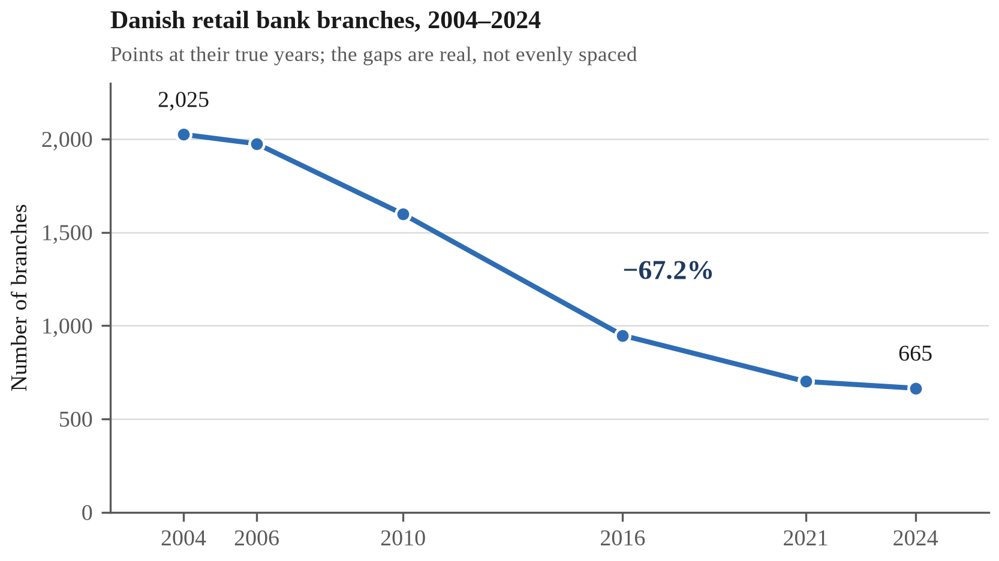

*Figure 1. Danish retail bank branches, 2004-2024. Finans Danmark; workbook 06_SERIES.*

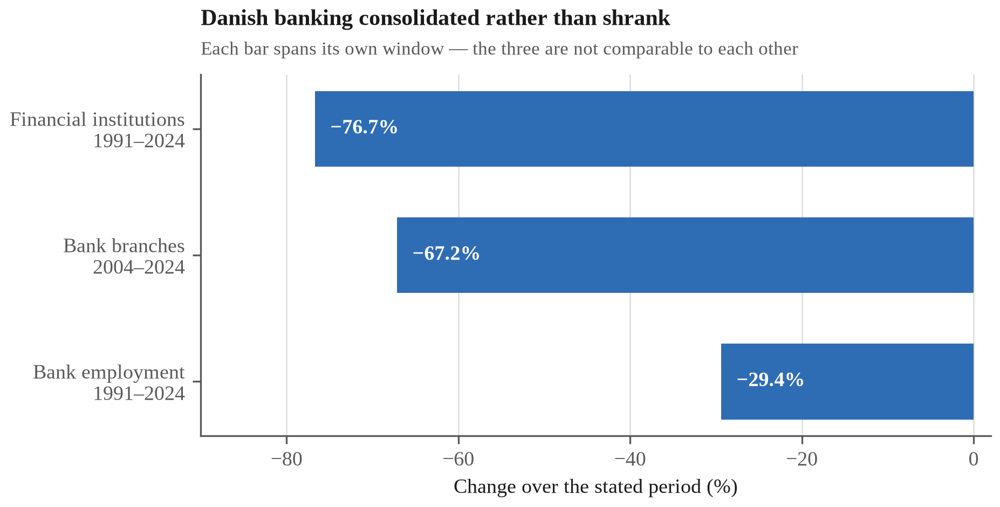

*Figure 2. Danish banking consolidation: institutions, branches, employment. The three series begin in different years and must never be differenced. Finans Danmark; workbook 06_SERIES.*

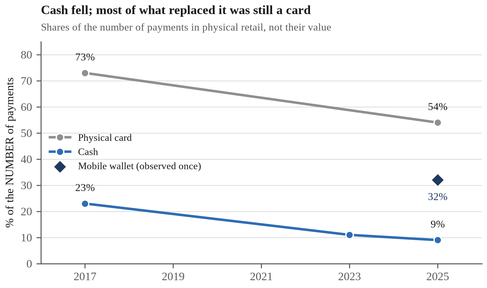

*Figure 3. Instrument shares of physical-retail payments, 2017-2025. Danmarks Nationalbank; workbook F2_PAYMENTS.*

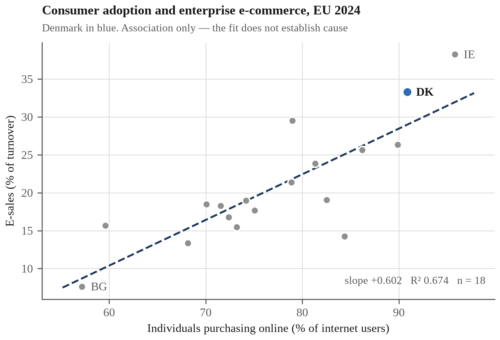

*Figure 4. Consumer adoption and enterprise e-commerce turnover, EU 2024. Eurostat; workbook F6_ADOPT_BENEFIT.*

---

## Question 2. Policy comparison: SME digitalisation support in Denmark and Germany

Denmark's difficulty is not getting technology to its firms but getting value out of it once it arrives, and both policies compared below address that gap. Its citizens rank first in the Union on e-government use, yet its firms rank second on e-sales while only 39% make any, behind Lithuania at 43% (Eurostat 2025b): a high rank on a low level is the problem rather than the achievement.

Intensity has risen where breadth has not, since e-sales grew from 17% of enterprise turnover in 2014 to 33% in 2024 against an EU-27 average moving from 16% to 19% (Figure 5): the firms that do sell online depend on it heavily, while the majority do not sell online at all. The newest technology divides along the same line, for the European Commission (2026) reports that 42% of Danish enterprises used artificial intelligence in 2025, comprising 75% of large firms against 41% of small and medium ones (Figure 6). This is not a connectivity failure, since 92% of Danish SMEs clear the basic digital-intensity threshold against an EU average of 71%. What they lack is the complementary capital, namely data, systems integration and specialist staff, that converts access into application.

Denmark's SMV:Digital and Germany's *Digital Jetzt* were built for this purpose, both being co-financed grants aimed at small and medium enterprises that would not otherwise invest. They differ chiefly in how they choose recipients: SMV:Digital scores applications and funds the highest scorers until the pool is exhausted (SMV:Digital 2026), whereas *Digital Jetzt* allocated by lottery among eligible applicants.

**Effectiveness.** Denmark's scheme is the better evidenced, since Digitaliseringsstyrelsen (2025b) links recipients to Danmarks Statistik registers and compares them with matched controls, reporting revenue growth of 18% against 13% and employment growth of 8% against 4%. No comparable estimate is published for *Digital Jetzt*, whose allocation rule moreover drew an objection Denmark's does not face. The Bundesrechnungshof (2022) criticised awarding funding by lottery rather than on criteria, warned that firms would postpone investment while awaiting a favourable draw, and called for the procedure to be discontinued. A lottery makes the grant a prize worth waiting for, and waiting is the opposite of what the scheme exists to produce.

**Weaknesses.** Denmark's advantage is nevertheless narrower than it appears, because matching addresses selection on what the registers record, namely sector, size, age and prior trajectory, and not on what they do not. Selection into a voluntary scheme runs on managerial ambition and the slack to write an application, traits that independently produce revenue growth, so the matched estimate retains an upward bias of unknown size. Neither scheme reaches the firms that never apply.

**Recommended improvement.** The remedy is latent in the Danish design, since SMV:Digital already scores its applicants and so already produces a funding threshold, which it then discards. Near that cut-off, funding turns on assessor variation rather than on the firm, which makes applicants just above and below comparable on precisely the unobservables that defeat matching. Retaining the scores and publishing the cut-off would therefore permit a regression discontinuity estimate at administrative cost alone (Appendix B).

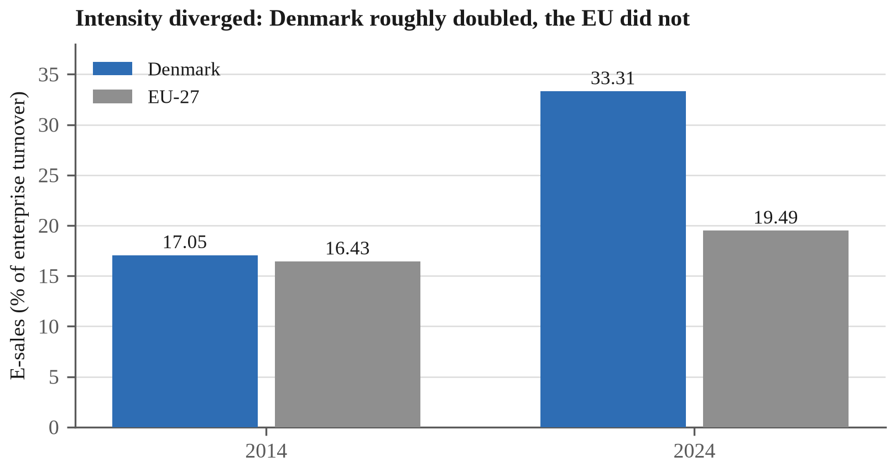

*Figure 5. E-sales share of enterprise turnover, Denmark and EU-27, 2014 and 2024. Eurostat; workbook 06_SERIES.*

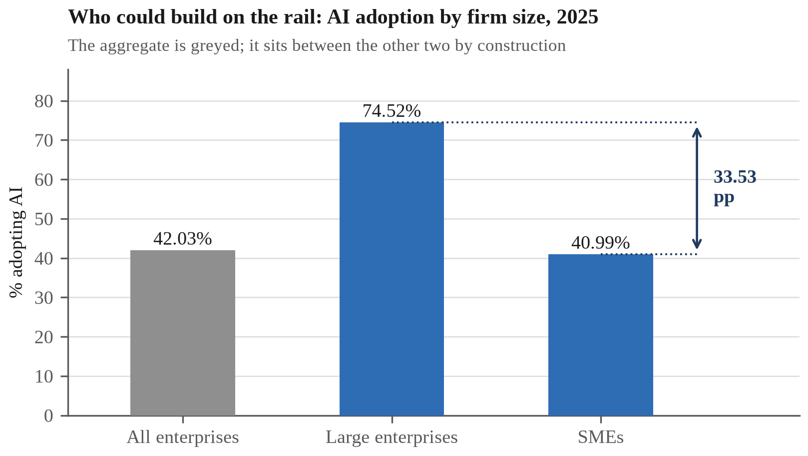

*Figure 6. AI adoption by firm size, Denmark 2025. European Commission; workbook 06_SERIES.*

---

## Question 3. Digitalisation and Sustainable Development Goal 12

Sustainable Development Goal 12, on responsible consumption and production, is the goal Danish digitalisation has most clearly moved, and it has moved it in both directions at once, since digital infrastructure substitutes information for materials at the point of use while creating a new material stream at disposal. Denmark is unusually far along the first and far behind on the second.

The positive contribution is a dematerialisation benefit, and unusually it has been audited: Rigsrevisionen (2016) could verify roughly DKK 450 million a year of the saving projected from compulsory Digital Post, the verified component being precisely postage, paper and envelopes. That prices the paper avoided rather than weighing it, but the substitution covers correspondence with every adult in the country. Private payments substitute in the same way, Danmarks Nationalbank (2025) reporting that cash fell from 23% to 9% of physical retail payments between 2017 and 2025: a share rather than a volume, which establishes direction without quantity.

Against this, Denmark performs the disposal side of the same goal badly, for the European Commission (2026) reports that it recycled or prepared for reuse 15% of the ICT waste collected in 2023 against an EU-27 average of 80% (Figure 7). The denominator narrows the claim, because the base is ICT waste *collected*: the indicator describes what happens to devices reaching the waste stream, while remaining silent on how many never do. Nor does any trend accompany it, the source publishing a single year, which makes 15% a level and not a direction. On the measure that exists, a country at or near the top of the Union on almost every digital indicator sits near the bottom on this one.

The two halves are connected by the same policy, which makes the contrast more than coincidence: a mandate requiring every adult to transact digitally also requires every adult to hold a device capable of running MitID, and that obligation was justified on an administrative saving alone. The environmental case for Danish digitalisation has accordingly been made on dematerialisation, while the circularity side of the same goal is where performance is weakest.

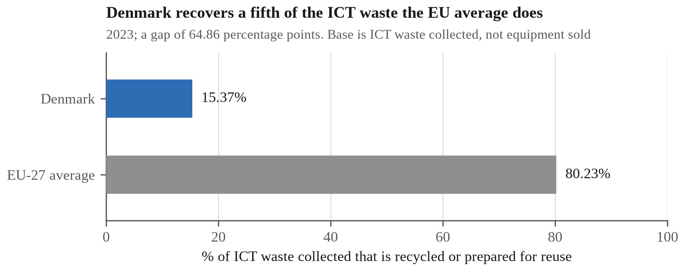

*Figure 7. ICT waste recycled or prepared for reuse, 2023. European Commission; workbook 06_SERIES.*

---

## Question 4. Digital inclusion: older citizens and the Digital Post mandate

A mandate binding every adult falls most heavily on those least able to comply, whose only relief is statutory exemption from Digital Post. The scale of that relief among the oldest citizens therefore indicates the difficulty: Digitaliseringsstyrelsen (2026) reports that nearly one citizen in five aged 75 to 84 holds a formal exemption, rising to roughly one in three among those 85 and over.

The measure on which Denmark ranks first is the one least able to detect this, since Eurostat (2026a) puts Danish e-government use at 98.5% while the survey asks only whether a person interacted online at all, once, in twelve months. It records reach, and says nothing about whether the attempt succeeded or was made independently (Figure 8).

Measuring the problem rather than the reach means choosing between estimates that do not agree, the narrowest being exemption itself: in the first quarter of 2026, 4.7% of citizens aged 15 and over, or 238,479 people, held one. The European Commission (2026) reports that 16.5% of Danes have difficulty using digital public services, while Digitaliseringsstyrelsen (2025c) and Justitia (2022) put the widest estimates near a quarter of adults. These are not points on a scale, since measure, year and denominator differ; Figure 9 sets them side by side and Appendix C reconciles them. Because the counts are clearer than the percentages, the conversion is worth making: against a population of 6,025,603 (Danmarks Statistik 2026), 16.5% is roughly 994,000 people to 238,479 exempt, meaning that some three-quarters of a million Danes struggle with a compulsory system while holding no standing outside it.

That gap is administrative rather than a skills deficit, as the skills data make clear: Denmark's weakest age band, those aged 55 to 74, reaches 68% with at least basic digital skills against an EU average of 43%, and Denmark leads the Union in all three bands (Figure 10). The mandate is therefore calibrated above the bottom of its own distribution, and the exemption criteria are drawn more narrowly than the difficulty they relieve.

The criteria should accordingly be widened to admit documented difficulty rather than the listed statutory grounds alone, and Denmark has solved the adjacent problem already. Folketinget (2023) provided that from June 2023 an exempt citizen is entitled, on request, to a non-digital alternative to any mandatory self-service solution. That decoupled the channel from the obligation but left the qualifying criteria untouched, because the right runs only to those already exempt. The Conseil d'État (2022) and the Belgian Cour constitutionnelle (2025) have since attached the equivalent entitlement to the difficulty itself rather than to a prior status (Appendix D).

*Figure 8. E-government reach against the measures it cannot see, Denmark. Left panel, Eurostat isoc_ciegi_ac, individuals aged 16 to 74, 2024; right panel, European Commission and Digitaliseringsstyrelsen, 2026, each measure on its own base. The panels are not comparable and are never differenced; workbook 06_SERIES.*

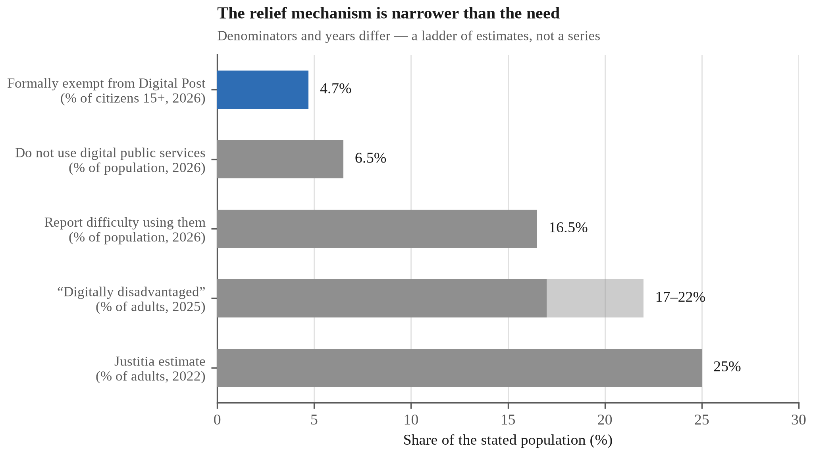

*Figure 9. Five estimates of Danish digital exclusion; denominators and years differ. Workbook F4_EXCLUSION.*

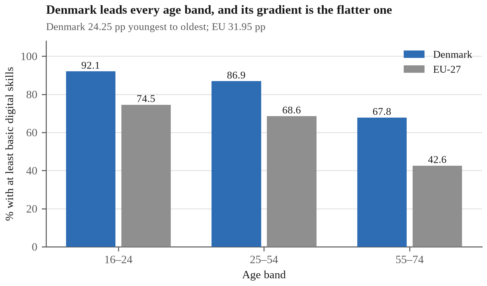

*Figure 10. Basic digital skills by age band, Denmark and EU-27, 2025. European Commission; workbook 06_SERIES.*

---

## Question 5. Guest speaker reflection: AI, sustainability and the Danish digital economy

The session addressed corporate sustainability at PwC rather than digital government, so the connection to Denmark was not the one I expected. It rests on an idea running through both halves of the talk: adoption is easy to claim and effect is hard to prove, and what separates them is who does the measuring.

Tran (2026) reported that in a PwC survey of Asia-Pacific chief executives, 82% had adopted generative artificial intelligence within five years while far fewer could identify revenue attributable to it. Denmark shows the same gap, adoption being high by European standards at 42% of enterprises yet concentrated at 75% of large firms against 41% of small and medium ones. Access has been distributed and capability has not, which is the conclusion Question 2 reaches from Danish registers and the speaker from a regional survey.

The sustainability half supplied a test for that kind of claim. Tran's position was that a net zero commitment means little unless an external body has validated it, because an unvalidated commitment is one the claimant grades itself; PwC's own reduction of 22% is stated against a target the Science Based Targets initiative validated. Applied to Denmark, that standard is uncomfortable, since SMV:Digital's headline figures are reported by participants to the body funding the scheme (Digitaliseringsstyrelsen 2025b), which is why Question 2 recommends an evaluation the agency does not run. Question 3 meets the standard from the other side, Denmark's position on ICT waste recovery being measured externally rather than self-reported, which is why it can be stated at all.

One detail transfers directly to policy: Tran put the cost of validation at USD 10,000 to 25,000, which in practice restricts it to large corporations, and described public programmes extending that capability to smaller firms. That is the same instrument, and the same justification, as SMV:Digital, since the fixed cost of proving anything, emissions or returns, weighs the more heavily on the smaller firm.

---

## References

Bundesrechnungshof 2022, Bemerkungen 2022 zur Haushalts- und Wirtschaftsführung des Bundes, German Federal Court of Auditors, accessed 13 September 2026, <https://www.bundesrechnungshof.de/SharedDocs/Pressemitteilungen/DE/2022/bemerkungen2022-hauptband.html>.

Conseil d'État 2022, Decision No. 452798, 3 June 2022, Conseil d'État, Paris, accessed 13 September 2026, <https://www.conseil-etat.fr/fr/arianeweb/CE/decision/2022-06-03/452798>.

Cour constitutionnelle 2025, Arrêt no. 126/2025, 25 September 2025, ECLI:BE:GHCC:2025:ARR.126, Cour constitutionnelle, Brussels, accessed 13 September 2026, <https://fr.const-court.be/public/f/2025/2025-126f.pdf>.

Danmarks Nationalbank 2025, Danskernes betalingsvaner, Danmarks Nationalbank, Copenhagen, accessed 12 September 2026, <https://www.nationalbanken.dk/en/what-we-do/safe-and-efficient-payments/payment-habits-in-denmark>.

Danmarks Statistik 2026, Befolkningstal, Statistics Denmark, Copenhagen, accessed 12 September 2026.

Denmark 2012, Lov om Offentlig Digital Post (LOV nr 528 af 11/06/2012), Retsinformation, Copenhagen, accessed 12 September 2026.

Digitaliseringsdirektoratet 2025, Kontakt- og reservasjonsregisteret, Norwegian Digitalisation Agency, accessed 13 September 2026, <https://www.digdir.no/digitale-felleslosninger/kontakt-og-reservasjonsregisteret-krr/865>.

Digitaliseringsstyrelsen 2023, NemID is about to be closed, MitID, Agency for Digital Government, Copenhagen, accessed 14 September 2026, <https://www.mitid.dk/en-gb/about-mitid/news/nemid-is-about-to-be-closed/>.

Digitaliseringsstyrelsen 2025a, Digital Post – lovgivning, Agency for Digital Government, Copenhagen, accessed 12 September 2026.

Digitaliseringsstyrelsen 2025b, Effektmåling af SMV:Digital, prepared by Danmarks Statistik, Agency for Digital Government, Copenhagen, accessed 12 September 2026, <https://digst.dk/media/yz2ouzzz/effektmaaling-af-smvdigital-2025.pdf>.

Digitaliseringsstyrelsen 2025c, Hvem oplever udfordringer ved det digitale?, Agency for Digital Government, Copenhagen, accessed 12 September 2026.

Digitaliseringsstyrelsen 2026, Statistik om Digital Post, Agency for Digital Government, Copenhagen, accessed 12 September 2026.

European Commission 2026, Digital Decade 2026 country report: Denmark, SWD(2026) 155 final, Part 7/27, European Commission, Brussels.

Eurostat 2025a, E-commerce statistics for individuals, European Commission, Luxembourg, accessed 12 September 2026.

Eurostat 2025b, EU enterprises' online sales reach new heights, European Commission, Luxembourg, accessed 12 September 2026.

Eurostat 2025c, Share of enterprises' turnover on e-commerce (tin00110), European Commission, Luxembourg, accessed 12 September 2026.

Eurostat 2026a, E-government activities of individuals via websites, dataset isoc_ciegi_ac, Statistical Office of the European Union, Luxembourg, accessed 14 September 2026, <https://ec.europa.eu/eurostat/databrowser/view/isoc_ciegi_ac/default/table?lang=en>.

Eurostat 2026b, Internet purchases by individuals (2020 onwards), dataset isoc_ec_ib20, Statistical Office of the European Union, Luxembourg, data last updated 17 April 2026, accessed 12 September 2026, <https://ec.europa.eu/eurostat/databrowser/view/isoc_ec_ib20/default/table?lang=en>.

Finans Danmark 2025, Institutter, filialer & ansatte, Finans Danmark, Copenhagen, accessed 12 September 2026, <https://finansdanmark.dk/tal-og-data/institutter-filialer-ansatte/>.

Folketinget 2023, Lov om fravigelse fra obligatorisk digital selvbetjening, LOV nr 603 af 31. maj 2023, in force 1 June 2023, Retsinformation, accessed 13 September 2026, <https://www.retsinformation.dk/eli/lta/2023/603>.

Howell, ST 2017, 'Financing innovation: evidence from R&D grants', American Economic Review, vol. 107, no. 4, pp. 1136-1164.

Institut for Menneskerettigheder 2023, Rettigheder i den digitale velfærdsstat, Danish Institute for Human Rights, Copenhagen, accessed 12 September 2026.

Justitia 2022, Retssikkerhed for digitalt udsatte borgere, Justitia, Copenhagen, accessed 12 September 2026.

Rigsrevisionen 2016, Beretning om besparelsespotentialet ved obligatorisk Digital Post på ca. 1 mia. kr. om året, National Audit Office of Denmark, Copenhagen, accessed 12 September 2026.

Santoleri, P, Barrows, G, Caravella, S, Crespi, F and Pellegrino, G 2022, The causal effects of R&D grants: evidence from a regression discontinuity, working paper, accessed 13 September 2026, <https://pietrosantoleri.github.io/files/Santoleri_et_al_The_effects_of_R_D_grants.pdf>.

SMV:Digital 2026, Tilskudspuljer i 2026, SMV:Digital, Copenhagen, accessed 12 September 2026.

Tran, TT 2026, 'Guest speaker session: corporate sustainability and the adoption of artificial intelligence', guest lecture, ECON1596 Business Challenges in the Digital Economy, RMIT University Vietnam, Ho Chi Minh City, [LECTURE DATE: to be completed by the author].

---

## Appendix A. Regression Diagnostics

This appendix supports the regression reported in Question 1. The cross-section is eighteen member states holding both measures for 2024: the share of internet users who purchased online (Eurostat 2026b) and e-sales as a share of enterprise turnover (Eurostat 2025c). All computation is reproducible from `02_MASTER`; the workbook computes the same statistics as live formulas on sheet `F6_ADOPT_BENEFIT`.

### A.1 The estimate

| Statistic | Value |
|---|---|
| Slope | +0.6022 pp turnover per pp adoption |
| Standard error | 0.1047 |
| t (16 df) | 5.749 |
| 95% confidence interval | [0.380, 0.824] |
| R² | 0.674 |
| Residual standard error (RMSE) | 4.450 pp |
| n | 18 |

The interval is the honest statement of what eighteen observations support. At the lower bound a percentage point of adoption is worth 0.38pp of turnover; at the upper bound, 0.82. The point estimate alone would overstate the precision by a factor of roughly two.

### A.2 Residuals

Figure A1

No state is mispredicted by more than two residual standard errors, so the linear form is not obviously wrong. The largest positive residuals are Belgium (+7.69pp, +1.73 RMSE), Ireland (+6.31, +1.42) and Italy (+5.51, +1.24).

Denmark's residual is **+4.34pp, or +0.97 RMSE, fourth largest of eighteen**. This is the figure that killed an earlier version of this report's argument. A residual inside one standard error, with three states further above the line, is an ordinary position on the fitted relationship, not evidence that Denmark converts adoption into commercial activity unusually well. Question 1 says only that Denmark sits above the line and within one standard error of it.

### A.3 Leave-one-out stability

Figure A2

Re-estimating the slope eighteen times, dropping each member state in turn, gives a range of **[0.516, 0.672]**. The slope never approaches zero and never changes sign, and every re-estimate falls inside the full-sample confidence interval. Ireland is the most influential single observation: dropping it moves the slope by −0.086, about 14%. That is unsurprising, since Ireland is the extreme point on both axes, and it is the reason Question 1 quotes an interval rather than a point.

### A.4 Selection on the tails, measured

Figure A3

An earlier version of this figure drew its adoption values from a Eurostat news release (Eurostat 2025a), which named nine countries: the three highest, the three lowest and three notable movers. Six of those nine also report the turnover measure, so the figure originally rested on six observations drawn entirely from the ends of the distribution.

| Sample | n | Slope | R² |
|---|---|---|---|
| Six tail countries (press-release values) | 6 | +0.655 | 0.853 |
| All eighteen (databrowser extract) | 18 | +0.602 | 0.674 |

The slope moved by about 8%; the fit fell by 0.18. Selecting on the tails therefore inflated the apparent explanatory power far more than it biased the estimated relationship, which is the characteristic signature of range restriction in reverse, and a demonstration of selection bias measured on this report's own data rather than asserted from a textbook.

One detail matters for anyone reproducing this. The tail-sample statistics are computed from the **rounded values the press release printed** (Ireland 96, Denmark 91, Germany 83, Hungary 79, Italy 60, Bulgaria 57), because the point is what the earlier figure actually showed. Recomputing the same six countries from the databrowser's unrounded values gives a slope of 0.658 and R² of 0.854: the same conclusion, marginally different digits.

### A.5 Is the missing third of the EU missing for a reason?

Nine member states report adoption but not turnover: EE, EL, FI, LT, LV, NL, PT, RO and SK. If they were absent because of something correlated with the outcome, the estimate would be selected rather than merely incomplete.

They average **75.67%** on adoption against the plotted eighteen's **77.23%**, a difference of −1.57pp, with a two-sample t of −0.372 on 25 degrees of freedom, p ≈ 0.71. The two groups are therefore statistically indistinguishable on the x-axis, so that the sample is missing on availability of the outcome measure rather than selected on the regressor.

That test has a limit worth stating, since the limit is the strongest objection to this section. Balance on the regressor is not balance on the outcome, and the reasons a national statistical institute fails to publish an e-sales turnover figure are not all random with respect to economic structure. Eurostat requires turnover at basic prices excluding VAT, and rejects national submissions failing coherence checks against Structural Business Statistics. Web and EDI sales behave differently, since EDI carries industrial business-to-business volume, so a small change in which large manufacturers fall into the sample can move a national share by several points. Secondary suppression, finally, removes a national total outright where one or two dominant firms in a NACE division would let their figure be recovered by subtraction. That last mechanism is the troubling one: it makes missingness a function of market concentration, which is plausibly related to enterprise e-commerce intensity. A balance test on consumer adoption cannot detect it. The honest statement is that the nine are missing for administrative and disclosure reasons rather than for anything this section could observe, which is weaker than missing at random and stronger than selected on the outcome.

### A.6 What this design still cannot do

Adoption is measured on consumers and turnover on enterprises, including business-to-business ordering no consumer ever touches, so the two axes are not two sides of one transaction. National income appears on neither axis and would plausibly raise both. Both are single-year cross-sections, so nothing here identifies a direction of causation. The relationship is an association that survives every robustness check available on eighteen observations, and that is the whole of the claim.

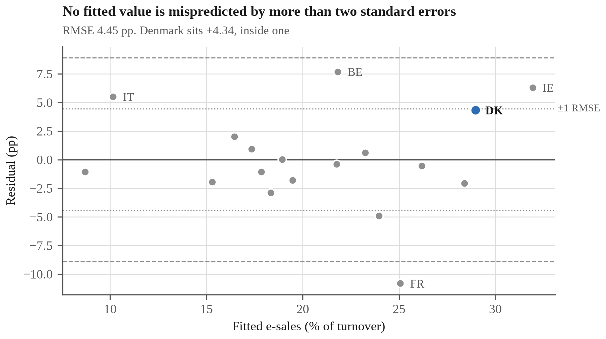

*Figure A1. Residuals against fitted values, EU 2024 regression. Workbook F6_ADOPT_BENEFIT.*

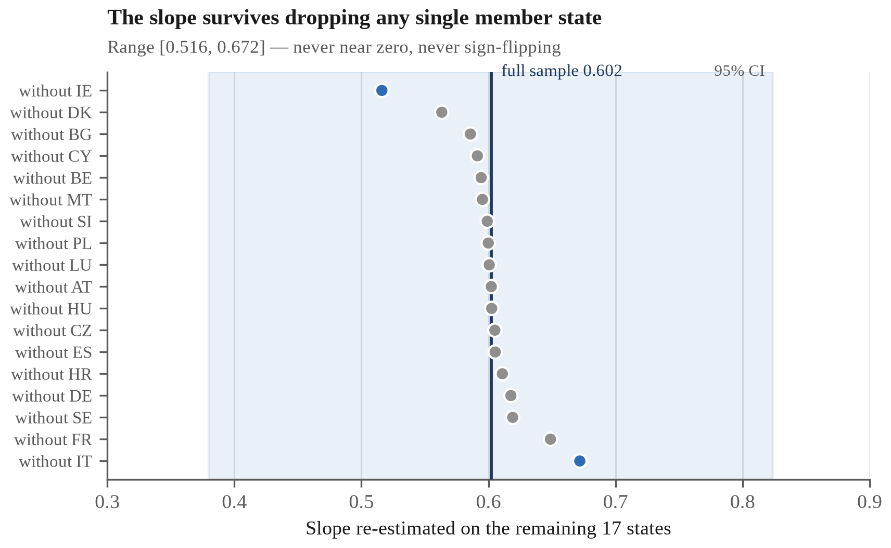

*Figure A2. Leave-one-out slopes, all 18 drops. Workbook F6_ADOPT_BENEFIT.*

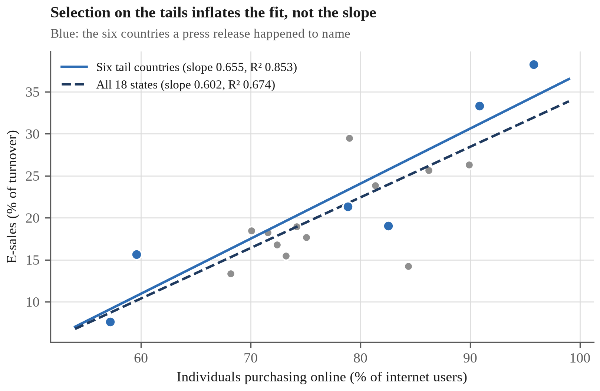

*Figure A3. The six tail countries against the full cross-section. Workbook F6_ADOPT_BENEFIT.*

---

## Appendix B. Policy Specification and Implementation Timeline

The restructuring Question 2 recommends, which would let SMV:Digital measure its own effect, is a research design as much as a policy, and a design is only as good as its specification. This appendix states it at the level of detail an administering agency would need in order to act on it.

### B.1 What the present scheme can and cannot establish

SMV:Digital is better evaluated than most such schemes, since Digitaliseringsstyrelsen links recipients to Danmarks Statistik registers and compares them with matched control firms, reporting revenue growth of 18% against the controls' 13%, a gap of five percentage points, and employment growth of 8% against 4% (Digitaliseringsstyrelsen 2025b). That is register data with a comparison group, and it disposes of the naive reading of the scheme's own headline, that 65% of participants invested further, which compares applicants with the general SME population and is in addition self-reported to the body funding the scheme.

The residual problem is the one matching cannot reach, because recipients are matched on what the registers record: sector, size, age, prior trajectory. Selection into a voluntary scheme runs on what they do not record: managerial ambition, an existing digitalisation plan, the slack to write an application. Those are precisely the traits that also produce revenue growth, so the matched estimate retains an upward bias of unknown size. Closing it requires variation in funding that is independent of the firm, and matching cannot manufacture that.

Figure B1

### B.2 The instrument

| Element | Specification |
|---|---|
| Instrument | Regression discontinuity at the eligibility scoring threshold |
| Legal vehicle | Administrative amendment to scheme guidelines; no primary legislation |
| Administering body | Erhvervsstyrelsen, via the SMV:Digital secretariat |
| Trigger condition | Applied where applications are scored and the pool is oversubscribed |
| Eligibility | Unchanged from the present scheme criteria |
| Allocation | Unchanged: highest-scoring applicants funded until the pool is exhausted |
| Treatment arm | Applicants scoring just above the funding cut-off |
| Control arm | Applicants scoring just below it |
| Identifying assumption | Baseline outcomes vary continuously across the cut-off; firms cannot precisely manipulate their own score |
| Primary outcome | Subsequent own-funded digital investment, from register data |
| Secondary outcomes | Employment, turnover, survival |
| Data source | Danmarks Statistik register linkage, not self-report |
| Legal basis for linkage | Statistical and research processing, as the existing effect measurement already relies on |
| Measurement window | Baseline at scoring; endline 24 months after project start |
| Required disclosure | Publication of all applicant scores and the cut-off |
| Marginal cost | Administrative only; neither budget nor allocation rule changes |

The design is not novel, which is the point of proposing it. Howell evaluated the US Department of Energy's SBIR programme by exploiting the ranking of applicants, finding that an early-stage award roughly doubles the probability of subsequent venture capital and raises patenting and revenue, with effects strongest among the most financially constrained firms (Howell 2017), which is the subgroup a Danish SME scheme is aimed at. Santoleri and colleagues applied the same approach to the Horizon 2020 SME Instrument's own scoring threshold (Santoleri et al. 2022). SMV:Digital already scores applicants; what it does not do is retain the scores in a form that permits the comparison those studies made.

Two assumptions do the work, and the table separates them because they are routinely conflated. Continuity requires that firms just below the cut-off would, absent the grant, have done about as well as those just above, which is what makes the comparison a counterfactual. No-manipulation requires that firms cannot place themselves on the funded side at will, which is testable after the fact by inspecting the density of scores around the threshold. Assessor-scored applications satisfy the second more credibly than a self-reported eligibility rule would.

Three features carry the argument. Near the cut-off, whether a firm is funded turns on assessor variation rather than on the firm, so above and below are comparable on the unobservables that defeat matching, which is the entire gain over the present evaluation. Nothing about who receives money changes: the highest-scoring applicants are still funded, so the reform imposes no cost on applicants and needs no new appropriation. The control arm, moreover, already exists, since those firms are being turned away today; the scheme simply stops discarding the information that it turned them away at a known distance from a known threshold.

### B.3 The alternative, and why it is rejected

The cleaner design is randomised allocation among eligible applicants, and an oversubscribed pool would supply it at no budgetary cost. Germany tried exactly that, and the result is a caution rather than a precedent: under *Digital Jetzt* the Bundesrechnungshof criticised allocation by lottery rather than on criteria, warning that firms would **postpone** investment while waiting for a favourable draw, and called for the procedure to be discontinued (Bundesrechnungshof 2022). The objection is not a technicality about budget law: a lottery makes the grant a prize worth waiting for, and waiting is the opposite of the behaviour the scheme exists to produce. A scoring threshold carries no such incentive, because applying at the highest quality one can manage remains the dominant strategy whichever side of the cut-off one lands on.

### B.4 What the design can and cannot deliver

The estimate is local to the threshold. It identifies the effect of the grant on marginal applicants, meaning firms the assessors found neither clearly strong nor clearly weak, rather than on the strongest recipients or on Danish SMEs generally. That is a narrower quantity than the present evaluation claims, and a credible one, which is the trade the design makes.

It also cannot detect effects on firms deterred from applying at all, which Question 2 identifies as the larger population. A discontinuity measures the scheme; it does not measure the gap the scheme was built to close.

### B.5 Timeline

Figure B2

The schedule is anchored on the grant pool opening 26 October 2026 (SMV:Digital 2026). The critical path runs through scoring and disclosure, not disbursement: every later step depends on the scores and the cut-off being recorded at the time, and none of it can be reconstructed afterwards. A scheme that allocates first and asks about effect later has already foreclosed the sharper answer, which is the position SMV:Digital is in today.

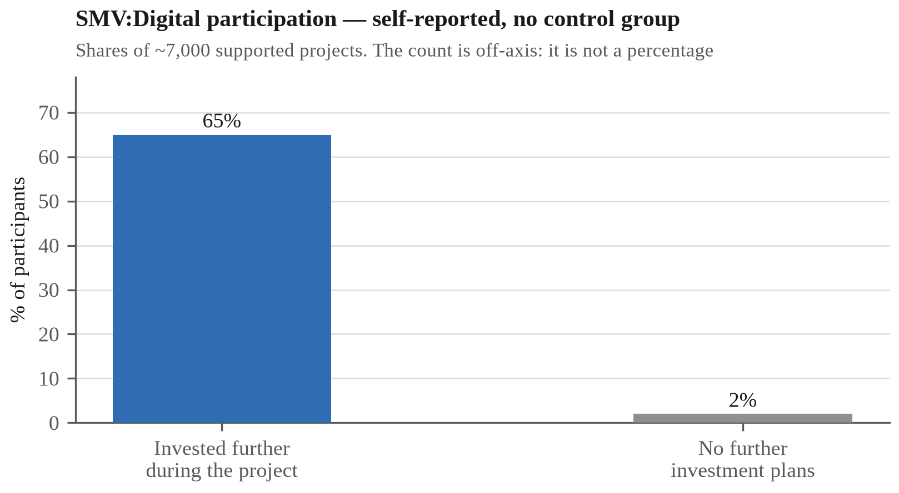

*Figure B1. SMV:Digital participation: self-reported by participants to the scheme's own funder. Workbook 06_SERIES.*

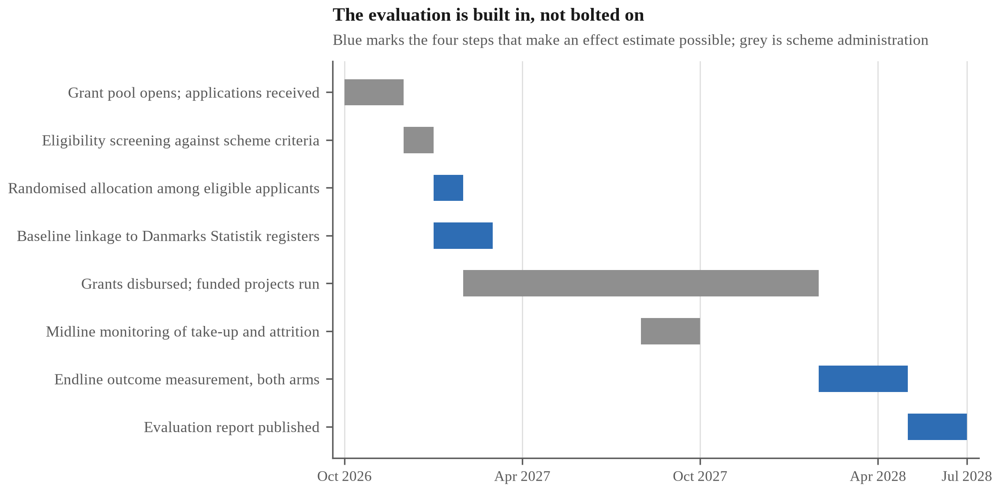

*Figure B2. Implementation and evaluation timeline for the SMV:Digital scoring-threshold design proposed in Question 2.*

---

## Appendix C. Reconciling the Exclusion Estimates

Question 4 reports five estimates of Danish digital exclusion ranging from 4.7% to 25%. They are not five measurements of one quantity, and this appendix sets out why, since the spread is itself the finding rather than an embarrassment.

### C.1 The estimates differ in three ways at once

| Estimate | Value | Year | Stated base | Source |
|---|---|---|---|---|
| Formally exempt from Digital Post | 4.7% | 2026 | Citizens aged 15+ | Digitaliseringsstyrelsen 2026 |
| Do not use digital public services | 6.5% | 2026 | Population | European Commission 2026 |
| Report difficulty using them | 16.5% | 2026 | Population | European Commission 2026 |
| "Digitally disadvantaged" | 17-22% | 2025 | Adult population | Digitaliseringsstyrelsen 2025c |
| Justitia estimate | Up to 25% | 2022 | Adult population | Justitia 2022 |

Three things vary together: what is being measured (a legal status, a behaviour, a self-reported difficulty, an analyst's category), the year, and the denominator. Any one of the three would make them non-comparable; all three together mean the ladder cannot be read as a series and the differences between its rungs cannot be taken.

### C.2 What that rules out

An earlier draft of Question 4 subtracted 4.7% from 16.5% and multiplied the 11.8-percentage-point gap by the 15+ base to obtain "roughly 600,000 citizens." That calculation is invalid twice over. The two rates rest on different denominators, so their difference is not a quantity; and applying the 15+ base to a percentage defined on the total population understates the count. The corrected figures appear in Question 4 as two separate counts rather than a difference.

### C.3 The ladder in people

Figure C1

Converting each estimate to a headcount on its own stated base makes the comparison legitimate, because counts of people share a unit where percentages of different populations do not.

Two of the five sources say "adult population" without defining it, and Denmark has no verified adult-population figure in this dataset. Those two are therefore shown as a range between the two defensible bases: the 15+ base of about 5.07 million implied by the Digital Post statistics, and the total population of 6,025,603 (Danmarks Statistik 2026). Choosing one silently is the error C.2 describes.

### C.4 What survives

Exemption reaches 238,479 people, whereas the narrowest estimate of need that measures difficulty rather than legal status is 16.5%, or roughly 994,000 on the stated base. The gap between the relief mechanism and the difficulty it relieves is therefore on the order of three-quarters of a million people, and that statement holds under any of the bases considered here, which is why Question 4 makes it in that form rather than as a precise subtraction.

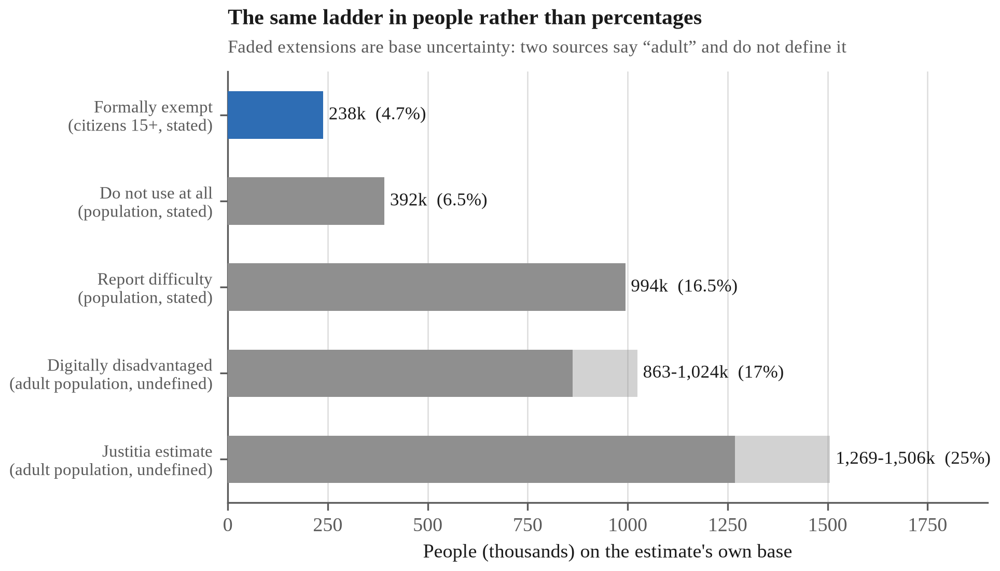

*Figure C1. The exclusion estimates converted to people on their own bases.*

---

## Appendix D. Comparative Law on Mandatory Digital Administration

Question 4 recommends widening the exemption criteria in *Lov om Offentlig Digital Post*. The case for doing so is not only domestic. Two European courts have in the last four years examined mandatory digital administration and set conditions Denmark's mandate does not meet, and one comparable state reached the same place without litigation at all. This appendix sets out each, and what follows for a Danish reform.

### D.1 France: mandatory digital service is lawful only on conditions

In Decision No. 452798 of 3 June 2022, the Conseil d'État partially annulled the decree requiring residence-permit applications to be made through the ANEF portal (Conseil d'État 2022). While the court accepted that a regulatory authority may compel the use of a digital service, it held that the obligation is lawful only where users retain normal access to the public service and can exercise their rights effectively, and that this must be assessed *in concreto* against five criteria: the object of the service, the complexity of the procedure, its consequences for those affected, the characteristics of the digital tool, and the characteristics of the public concerned, including any difficulty it has in accessing or using online services.

Two remedies followed: the administration must provide support for users who need it, and a non-digital substitute route where the digital one fails. The reasoning is the one this report has been making empirically: a mandate is justified by the capability of the population it binds, not by the capability of the median user.

### D.2 Belgium: the alternatives are cumulative, and cost is not a defence

In *Arrêt* No. 126/2025 of 25 September 2025, the Cour constitutionnelle ruled on the Brussels Digital ordinance of 2024 in an action brought by twenty-four associations and unions (Cour constitutionnelle 2025). It held that three non-digital channels, namely a physical counter, a telephone service and a postal route, are **cumulative**: each must be offered alongside the digital channel. Any substitute must itself be non-digital and deliver an equivalent level of service. Nor does the obligation lapse where meeting it imposes a disproportionate burden on the authority.

That last holding is the one that bites hardest on a business case. Denmark's justification for compulsory Digital Post is a projected saving (Question 4). The Belgian court's position is that the saving is not a reason the obligation ceases to apply, which, applied to a Danish debate conducted almost entirely in administrative-cost terms, reverses the burden of argument.

### D.3 Norway: the digital default binds the administration, not the citizen

The sharper contrast is not litigated at all. Norway made electronic communication the administrative default, *digitalt førstevalg*, but under the eGovernment regulations the obligation runs to the public body, and every citizen keeps a statutory right to opt out, the *reservasjonsrett*. The opt-out is recorded in the Contact and Reservation Register, which authorities must check before dispatching; a citizen who has opted out must be sent decisions on paper (Digitaliseringsdirektoratet 2025). Roughly 200,000 people hold a reservation, and Digdir notes the number has lately been falling rather than rising.

Two features distinguish this from the Danish arrangement, and neither is about how digital the state is. The first is that the entitlement attaches to the citizen rather than to an administrative status they must first qualify for, so that there is no gate of the kind Question 4 measures. It is also exercisable by telephone or on paper, which matters because an opt-out reachable only through the digital channel would be self-defeating. No rate is offered against Denmark's 4.7%: the Norwegian figure is a count of registrations and the base it should be taken on is not established by the source, which is the error Appendix C exists to name. The comparison worth making is the route rather than the rate: whether reaching a position outside the digital channel requires the state's permission or only the citizen's decision.

### D.4 What this does and does not establish

Neither ruling binds Denmark, and Norway's arrangement is a policy choice rather than a legal requirement on anyone else. The Conseil d'État decision concerns French administrative law and a specific applicant population, namely foreign nationals seeking residence permits, whose vulnerability the court treated as material. The Belgian ruling construes a Brussels regional ordinance against Belgian constitutional guarantees. Neither is a holding about *Lov om Offentlig Digital Post*, and this appendix does not claim that Denmark's mandate is unlawful.

What they establish is narrower and still useful: that mandatory digital administration is contested law in comparable European jurisdictions, and that where courts have examined it they have converged on a condition Denmark's scheme does not satisfy. Act 603 of 2023 gives a non-digital alternative to citizens already exempt from Digital Post (Folketinget 2023), whereas the French and Belgian rulings attach the entitlement to the *difficulty* rather than to a prior administrative status. That is precisely the gap Question 4 measured and Question 4 proposes to close, and the comparison shows the proposal is not an outlier but a convergence.

The point has also been made domestically. The Danish Institute for Human Rights, Denmark's national human rights institution, examined rights in the digital welfare state in December 2023 (Institut for Menneskerettigheder 2023). That a domestic body reached the subject independently of the litigation abroad is the more relevant fact here: the question is live in Denmark, not imported into it.
